# AVL Trees — Foundations & Rotations
## Why BSTs Break, How AVL Fixes Them, and Every Rotation Explained

---

## Table of Contents
1. [The Problem — How BSTs Degenerate](#1-the-problem--how-bsts-degenerate)
2. [The AVL Solution — The Balance Invariant](#2-the-avl-solution--the-balance-invariant)
3. [Balance Factor — The Core Metric](#3-balance-factor--the-core-metric)
4. [Height Tracking — Why Every Node Stores Its Height](#4-height-tracking--why-every-node-stores-its-height)
5. [The AVL Node Struct](#5-the-avl-node-struct)
6. [The 4 Imbalance Cases](#6-the-4-imbalance-cases)
7. [Right Rotation — Fixes LL Imbalance](#7-right-rotation--fixes-ll-imbalance)
8. [Left Rotation — Fixes RR Imbalance](#8-left-rotation--fixes-rr-imbalance)
9. [Left-Right Rotation — Fixes LR Imbalance](#9-left-right-rotation--fixes-lr-imbalance)
10. [Right-Left Rotation — Fixes RL Imbalance](#10-right-left-rotation--fixes-rl-imbalance)
11. [The Rotation Decision Tree](#11-the-rotation-decision-tree)
12. [C++ Rotation Implementations](#12-c-rotation-implementations)

---

## 1. The Problem — How BSTs Degenerate

You already know this from BST study. Let's make it concrete with numbers.

### Inserting sorted values: 10, 20, 30, 40, 50

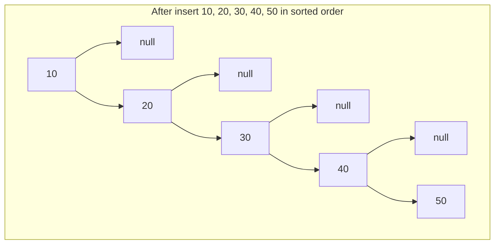

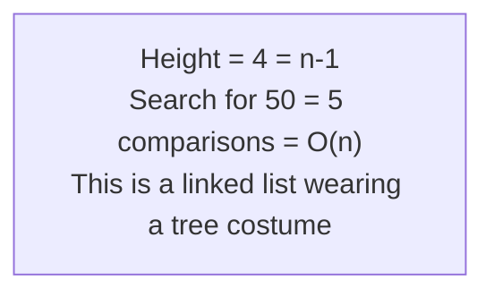

| # nodes | Balanced height | Degenerate height | Penalty |
|---|---|---|---|
| 7 | 2 | 6 | 3× worse |
| 15 | 3 | 14 | 5× worse |
| 1023 | 9 | 1022 | 114× worse |
| 1,000,000 | 19 | 999,999 | 52,631× worse |

**The core problem:** BST insert gives you no guarantee about height. You get O(log n) only with random data. With sorted (or nearly sorted) data — which is extremely common in practice — you get O(n).

---

## 2. The AVL Solution — The Balance Invariant

In 1962, Soviet mathematicians **Adelson-Velsky and Landis** published the first self-balancing BST. Their insight: after every insert or delete, check if any node became too unbalanced. If yes, fix it immediately with a rotation. The tree is always kept balanced.

> **AVL Invariant:** For every node in the tree, the heights of its left and right subtrees differ by **at most 1**.

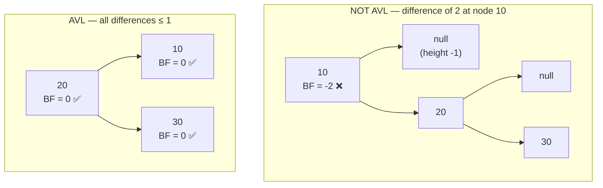

### Why the invariant guarantees O(log n)

An AVL tree with n nodes has height at most **1.44 × log₂(n)** — proved by considering the minimum number of nodes in an AVL tree of height h.

Let N(h) = minimum nodes in AVL tree of height h:
- N(0) = 1 (single node)
- N(1) = 2
- N(h) = 1 + N(h-1) + N(h-2) ← Fibonacci-like recurrence

This grows exponentially in h, meaning h grows at most logarithmically in n. Therefore all operations remain **O(log n) in the worst case**.

---

## 3. Balance Factor — The Core Metric

The **Balance Factor (BF)** of a node is:

```
BF(node) = height(node->left) - height(node->right)
```

Where `height(nullptr) = -1` by convention.

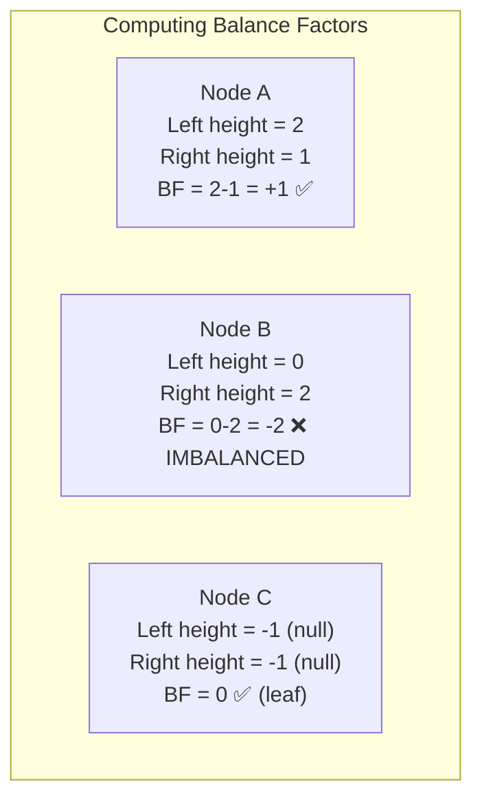

| BF Value | Meaning | Status |
|---|---|---|
| `+2` or more | Left subtree too tall | ❌ **Left-heavy, rebalance!** |
| `+1` | Left slightly taller | ✅ Valid |
| `0` | Perfectly balanced | ✅ Valid |
| `-1` | Right slightly taller | ✅ Valid |
| `-2` or less | Right subtree too tall | ❌ **Right-heavy, rebalance!** |

**Key insight:** BF can only reach ±2 immediately after an insert or delete (because the tree was balanced before). A single rotation (or double rotation) always restores it.

---

## 4. Height Tracking — Why Every Node Stores Its Height

In a plain BST, nodes only store `data`, `left`, `right`. For AVL we add `height`.

**Why not compute height on the fly?** Computing height requires traversing the subtree — O(n) per call. If we need it at every node during insertion (which goes O(log n) nodes deep), that's O(n log n) just for height checks. Storing height makes each check O(1).

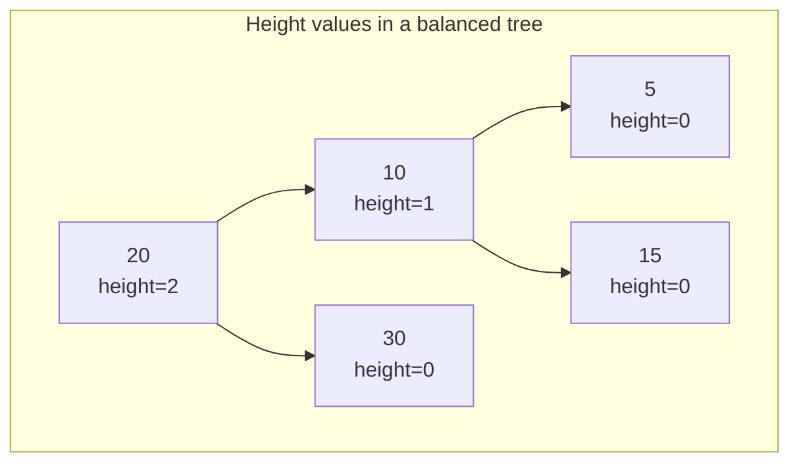

### Height update rule:

```
height(node) = 1 + max(height(node->left), height(node->right))
```

**Critical:** You MUST update heights **bottom-up** — children's heights must be correct before you can compute a parent's height. This is why the update happens during the recursive unwind (after recursing into children, before returning).

---

## 5. The AVL Node Struct

```cpp
struct Node {
    int data;
    Node* left;
    Node* right;
    int height;      // ← the only addition over plain BST

    Node(int val) : data(val), left(nullptr), right(nullptr), height(0) {}
    //                                                         height=0 for a new leaf
};

// ─── Helper utilities ───────────────────────────────────────────────────────

// Safe height — handles nullptr (returns -1)
int getHeight(Node* node) {
    return (node == nullptr) ? -1 : node->height;
}

// Balance Factor = left height - right height
int getBalanceFactor(Node* node) {
    if (node == nullptr) return 0;
    return getHeight(node->left) - getHeight(node->right);
}

// Recompute height from children (call after any structural change)
void updateHeight(Node* node) {
    if (node == nullptr) return;
    node->height = 1 + max(getHeight(node->left), getHeight(node->right));
}
```

---

## 6. The 4 Imbalance Cases

After every insertion, walk back up the tree. If any node has `|BF| == 2`, you have an imbalance. The TYPE of imbalance determines which rotation to apply.

The imbalance type is named after **where the new node was inserted** relative to the imbalanced node:

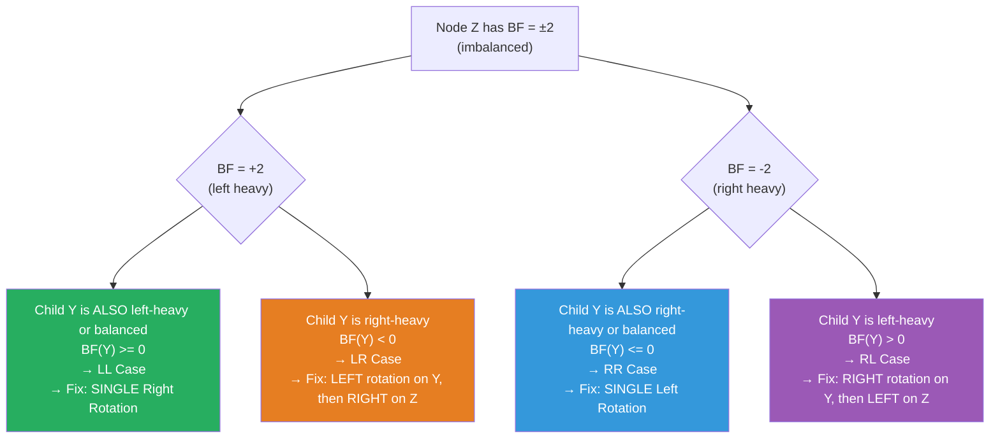

### Visual Summary — All 4 Cases

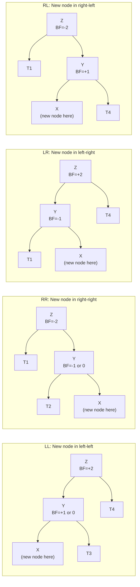

---

## 7. Right Rotation — Fixes LL Imbalance

### Scenario

Inserting into the **left subtree of a left child** causes a node `Z` to become left-heavy (BF = +2). Its left child `Y` is left-heavy or balanced (BF ≥ 0).

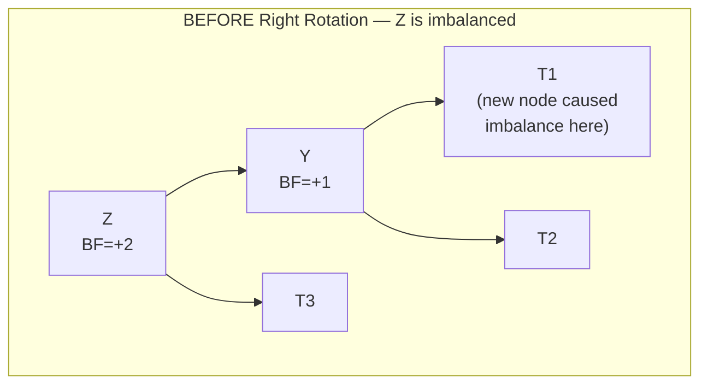

### What Right Rotation Does

Y "rises" to take Z's position. Z "falls" to become Y's right child. Y's old right subtree (T2) becomes Z's new left subtree (the only pointer that needs careful handling).

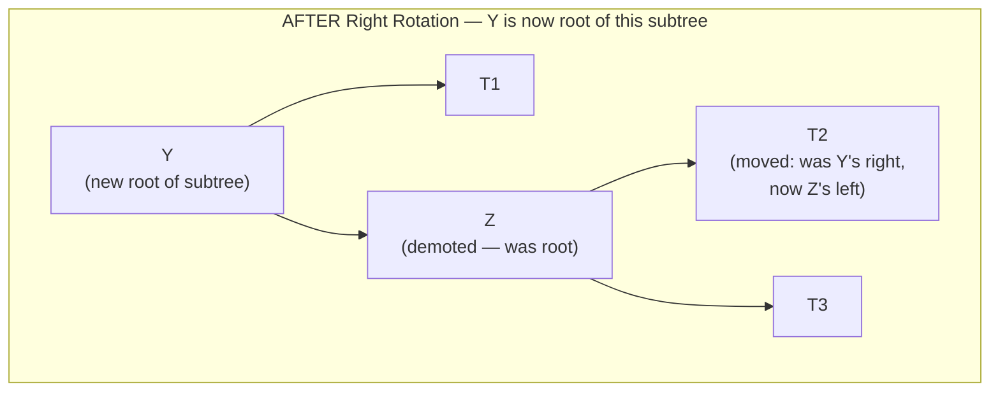

### Pointer Changes — Step by Step

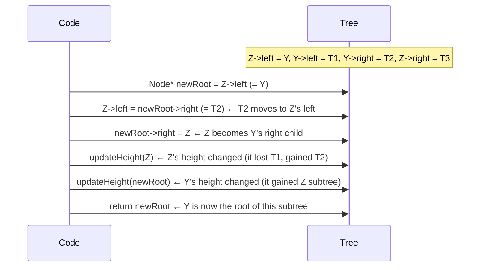

### C++ Implementation

```cpp
Node* rotateRight(Node* Z) {
    Node* Y  = Z->left;        // Y will become the new root
    Node* T2 = Y->right;       // T2 will be relocated

    // Perform rotation
    Y->right = Z;              // Z falls down to become Y's right child
    Z->left  = T2;             // T2 moves: was Y's right, now Z's left

    // Update heights — Z first (it's now lower), then Y (it's now higher)
    updateHeight(Z);
    updateHeight(Y);

    return Y;   // Y is the new root of this subtree — caller must wire this in
}
```

### Why T2 Must Move to Z->left

T2 contains values **between Y and Z** (they're in Y's right subtree, so > Y; and in Z's left subtree, so < Z). After rotation, T2 still needs to satisfy both constraints. Z is now Y's right child — T2 as Z's left child is still > Y and still < Z. ✅

---

## 8. Left Rotation — Fixes RR Imbalance

### Scenario

Inserting into the **right subtree of a right child** — mirror image of LL. Node `Z` is right-heavy (BF = -2), its right child `Y` is right-heavy or balanced (BF ≤ 0).

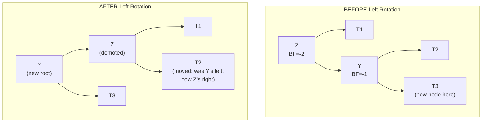

```cpp
Node* rotateLeft(Node* Z) {
    Node* Y  = Z->right;       // Y will become the new root
    Node* T2 = Y->left;        // T2 will be relocated

    // Perform rotation
    Y->left  = Z;              // Z falls down to become Y's left child
    Z->right = T2;             // T2 moves: was Y's left, now Z's right

    // Update heights — Z first (lower), then Y (higher)
    updateHeight(Z);
    updateHeight(Y);

    return Y;   // Y is the new root
}
```

**Why T2 moves to Z->right:** T2 has values between Z and Y (> Z, < Y). After rotation, Z is Y's left child — T2 as Z's right child is still > Z and still < Y. ✅

---

## 9. Left-Right Rotation — Fixes LR Imbalance

### Scenario

Node `Z` is left-heavy (BF = +2), but its left child `Y` is **right-heavy** (BF = -1). The new node is in Y's right subtree. A single right rotation on Z would NOT fix this — the tree would still be unbalanced after.

**This requires TWO rotations:** Left rotate Y first (converts it to LL case), then right rotate Z.

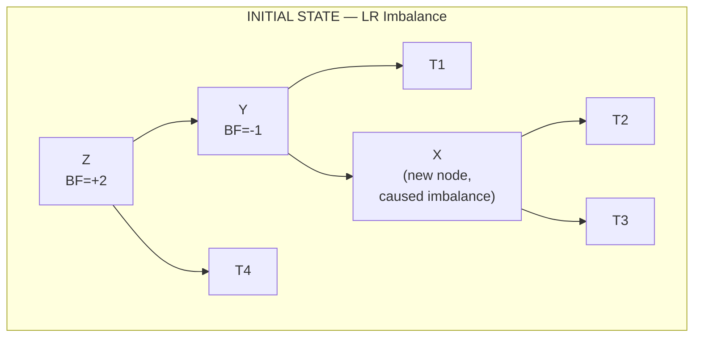

**Step 1 — Left Rotate Y (about Y):**

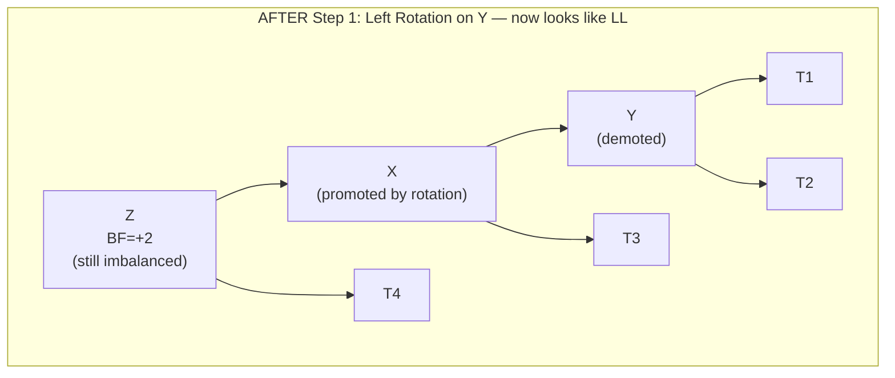

**Step 2 — Right Rotate Z (about Z):**

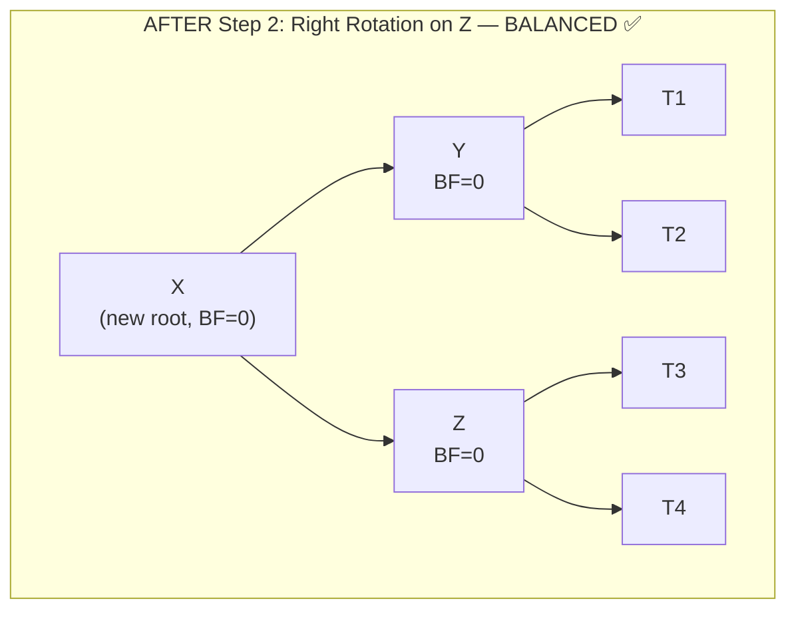

```cpp
Node* rotateLeftRight(Node* Z) {
    Z->left = rotateLeft(Z->left);   // Step 1: Left rotate Y
    return rotateRight(Z);           // Step 2: Right rotate Z
}
```

**Why one rotation fails:** After a single right rotation on Z with Y left-heavy, X (Y's right child) becomes Z's left child. X's own two subtrees are unbalanced. The double rotation ensures X ends up as the new root with Y and Z as its children — perfectly balanced.

---

## 10. Right-Left Rotation — Fixes RL Imbalance

### Scenario

Mirror of LR. Node `Z` is right-heavy (BF = -2), but right child `Y` is **left-heavy** (BF = +1). New node is in Y's left subtree.

**Two rotations:** Right rotate Y first, then left rotate Z.

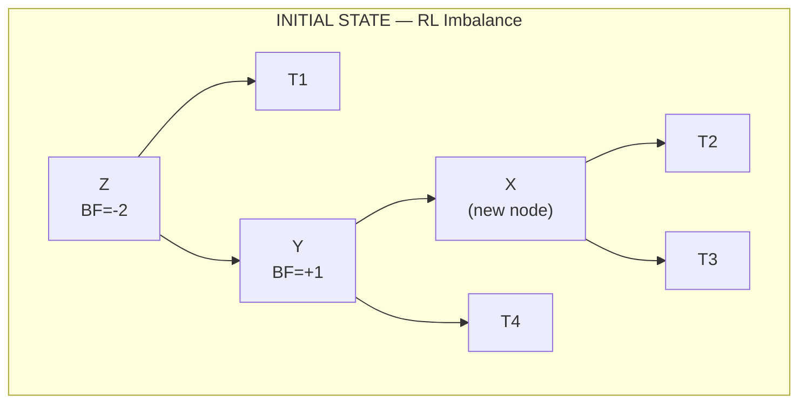

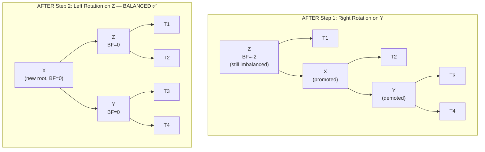

```cpp
Node* rotateRightLeft(Node* Z) {
    Z->right = rotateRight(Z->right);  // Step 1: Right rotate Y
    return rotateLeft(Z);              // Step 2: Left rotate Z
}
```

---

## 11. The Rotation Decision Tree

After inserting at any node, check its balance factor on the way back up. This decision tree tells you exactly what to do:

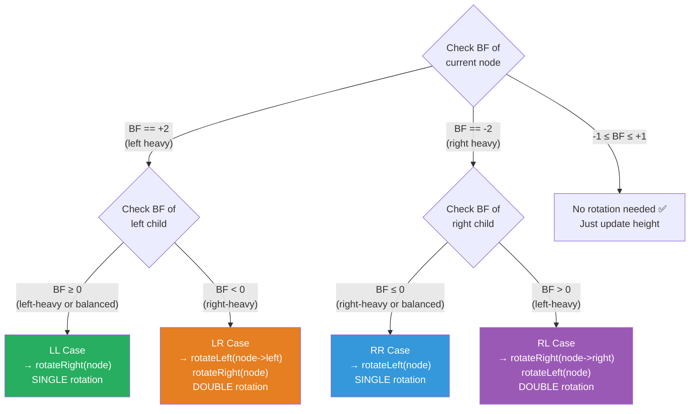

### The Memory Aid

```
BF = +2 → Left heavy → look at LEFT child's BF:
    Left child BF ≥ 0  →  LL  →  rotateRight
    Left child BF < 0  →  LR  →  rotateLeft(child) then rotateRight

BF = -2 → Right heavy → look at RIGHT child's BF:
    Right child BF ≤ 0  →  RR  →  rotateLeft
    Right child BF > 0  →  RL  →  rotateRight(child) then rotateLeft
```

---

## 12. C++ Rotation Implementations

Complete, copy-ready implementations with all edge cases handled:

```cpp
#include <iostream>
#include <algorithm>
using namespace std;

// ─── Node ────────────────────────────────────────────────────────────────────
struct Node {
    int data;
    Node* left;
    Node* right;
    int height;
    Node(int val) : data(val), left(nullptr), right(nullptr), height(0) {}
};

// ─── Height & Balance Utilities ──────────────────────────────────────────────
int getHeight(Node* n) {
    return n ? n->height : -1;
}

int getBalanceFactor(Node* n) {
    return n ? getHeight(n->left) - getHeight(n->right) : 0;
}

void updateHeight(Node* n) {
    if (n) n->height = 1 + max(getHeight(n->left), getHeight(n->right));
}

// ─── Right Rotation (fixes LL) ───────────────────────────────────────────────
//
//        Z                   Y
//       / \                 / \
//      Y   T3    →→→      T1   Z
//     / \                     / \
//   T1   T2                  T2  T3
//
Node* rotateRight(Node* Z) {
    Node* Y  = Z->left;
    Node* T2 = Y->right;

    Y->right = Z;
    Z->left  = T2;

    updateHeight(Z);    // Z first — it's now lower in the tree
    updateHeight(Y);    // Y second — it's now higher

    return Y;           // Y is the new subtree root
}

// ─── Left Rotation (fixes RR) ────────────────────────────────────────────────
//
//     Z                       Y
//    / \                     / \
//   T1   Y       →→→       Z   T3
//       / \               / \
//     T2   T3           T1   T2
//
Node* rotateLeft(Node* Z) {
    Node* Y  = Z->right;
    Node* T2 = Y->left;

    Y->left  = Z;
    Z->right = T2;

    updateHeight(Z);    // Z first — lower
    updateHeight(Y);    // Y second — higher

    return Y;
}

// ─── Left-Right Rotation (fixes LR) ─────────────────────────────────────────
//
//     Z            Z               X
//    /            /               / \
//   Y    →→→     X      →→→     Y   Z
//    \           / \
//     X         Y   (X's right)
//
Node* rotateLeftRight(Node* Z) {
    Z->left = rotateLeft(Z->left);   // Step 1: convert to LL
    return rotateRight(Z);           // Step 2: fix LL
}

// ─── Right-Left Rotation (fixes RL) ─────────────────────────────────────────
//
//   Z              Z               X
//    \              \             / \
//     Y   →→→        X   →→→   Z   Y
//    /                \
//   X            (X's left)  Y
//
Node* rotateRightLeft(Node* Z) {
    Z->right = rotateRight(Z->right);  // Step 1: convert to RR
    return rotateLeft(Z);              // Step 2: fix RR
}

// ─── Rebalance — applies the right rotation based on BF ──────────────────────
Node* rebalance(Node* node) {
    updateHeight(node);                  // always update height first

    int bf = getBalanceFactor(node);

    // LEFT HEAVY (BF == +2)
    if (bf == 2) {
        if (getBalanceFactor(node->left) >= 0) {
            return rotateRight(node);    // LL case
        } else {
            return rotateLeftRight(node); // LR case
        }
    }

    // RIGHT HEAVY (BF == -2)
    if (bf == -2) {
        if (getBalanceFactor(node->right) <= 0) {
            return rotateLeft(node);     // RR case
        } else {
            return rotateRightLeft(node); // RL case
        }
    }

    return node;   // balanced — no rotation needed
}
```

---

## Summary — The Complete Mental Model

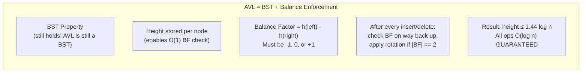

```
ROTATION CHEAT SHEET:
  BF = +2, left child BF ≥ 0   →  LL  →  rotateRight(Z)
  BF = +2, left child BF < 0   →  LR  →  rotateLeft(Z->left), rotateRight(Z)
  BF = -2, right child BF ≤ 0  →  RR  →  rotateLeft(Z)
  BF = -2, right child BF > 0  →  RL  →  rotateRight(Z->right), rotateLeft(Z)

POINTER CHANGES IN EACH ROTATION:
  rotateRight(Z): Y=Z->left, Y->right=Z, Z->left=T2 (T2=old Y->right)
  rotateLeft(Z):  Y=Z->right, Y->left=Z, Z->right=T2 (T2=old Y->left)

HEIGHT UPDATE ORDER:
  ALWAYS update the LOWER node (Z) before the HIGHER node (Y)
  Z's height changes (lost/gained subtrees) → must be recalculated first
```
