# AVL Trees — Insertion, Deletion & Complete Implementation
## Step-by-Step Walkthroughs + Full Working C++ Code

---

## Table of Contents
1. [AVL Insert — The Algorithm](#1-avl-insert--the-algorithm)
2. [Insert Case 1 — LL Rotation Triggered](#2-insert-case-1--ll-rotation-triggered)
3. [Insert Case 2 — RR Rotation Triggered](#3-insert-case-2--rr-rotation-triggered)
4. [Insert Case 3 — LR Rotation Triggered](#4-insert-case-3--lr-rotation-triggered)
5. [Insert Case 4 — RL Rotation Triggered](#5-insert-case-4--rl-rotation-triggered)
6. [AVL Delete — The Algorithm](#6-avl-delete--the-algorithm)
7. [Delete Walkthrough with Rebalancing](#7-delete-walkthrough-with-rebalancing)
8. [The Height-Update Order Problem](#8-the-height-update-order-problem)
9. [Complete C++ AVL Implementation](#9-complete-c-avl-implementation)
10. [Complexity Analysis](#10-complexity-analysis)
11. [AVL vs BST Comparison](#11-avl-vs-bst-comparison)

---

## 1. AVL Insert — The Algorithm

AVL insert is BST insert **plus rebalancing on the way back up**.

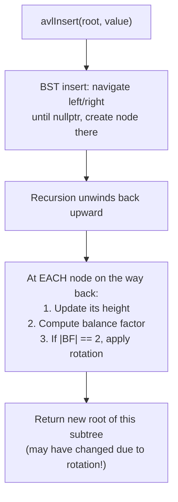

### How it differs from BST insert

| Step | BST Insert | AVL Insert |
|---|---|---|
| Navigate to slot | ✅ Same | ✅ Same |
| Create node | ✅ Same | ✅ Same |
| Unwind recursion | Just return root | **Update height + check BF + maybe rotate** |
| Return value | root (unchanged) | **new root** (may be rotated node) |

### The key structural choice: return-value rewiring

```cpp
Node* avlInsert(Node* root, int value) {
    // ── Step 1: Normal BST insert ──────────────────────────
    if (root == nullptr) return new Node(value);
    if (value < root->data) root->left  = avlInsert(root->left,  value);
    else if (value > root->data) root->right = avlInsert(root->right, value);
    else return root;  // duplicate — ignore

    // ── Step 2: Rebalance on the way back up ────────────────
    return rebalance(root);
    // rebalance() does: updateHeight, compute BF, rotate if needed, return new root
}
```

**The `return rebalance(root)` line is the entire addition.** Every ancestor on the path rewires itself to accept the potentially-rotated subtree.

---

## 2. Insert Case 1 — LL Rotation Triggered

**Sequence:** Insert 30, 20, 10

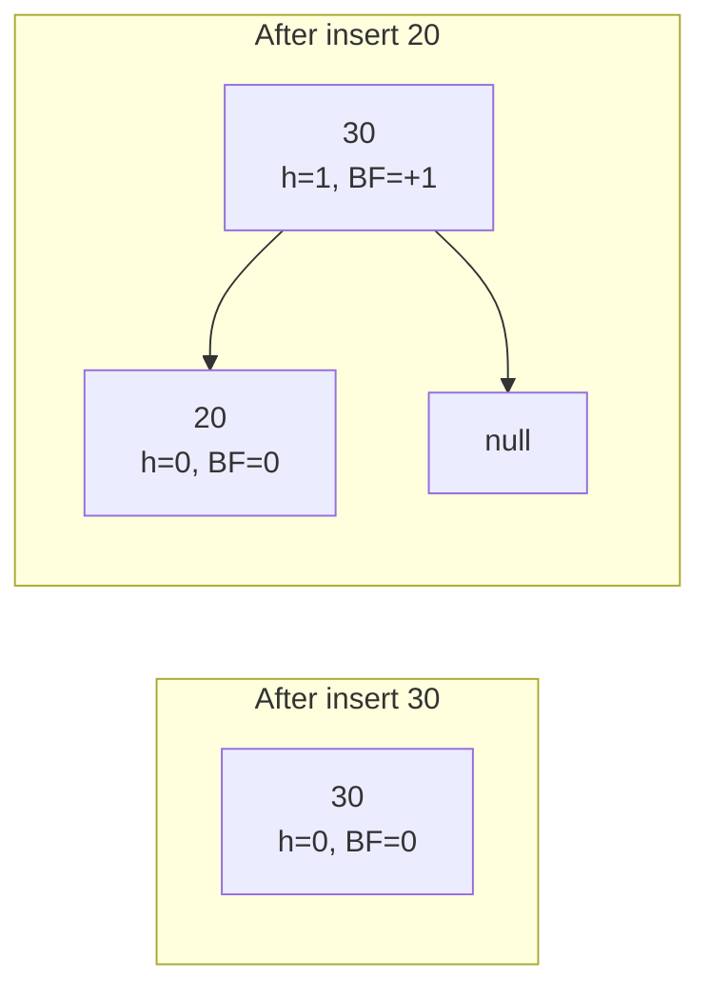

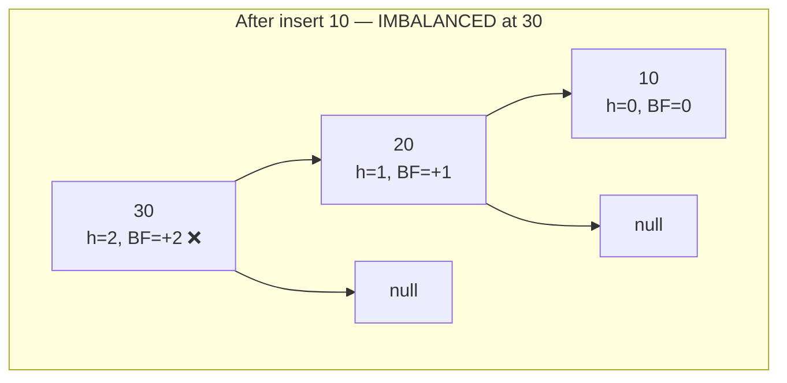

**Diagnosis:**
- Node 30: BF = +2 → Left heavy
- Left child 20: BF = +1 → Left heavy (≥ 0)
- **→ LL Case → rotateRight(30)**

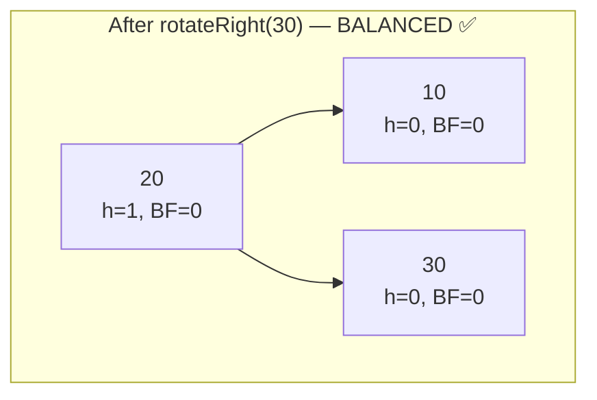

**Step-by-step code execution:**
```
avlInsert(root=30, 10):
  30: value 10 < 30 → go left
  avlInsert(root=20, 10):
    20: value 10 < 20 → go left
    avlInsert(root=null, 10):
      → return new Node(10)         [leaf created]
    ← back at 20: root->left = Node(10)
      rebalance(20): h(20)=1, BF=+1 → no rotation → return 20
    ← back at 30: root->left = 20
      rebalance(30): h(30)=2, BF=+2, left child BF=+1 → LL!
        rotateRight(30): Y=20, T2=20->right=null
          20->right = 30
          30->left = null
          updateHeight(30): h=0
          updateHeight(20): h=1
          return 20              [20 is new root]
      ← return 20
```

---

## 3. Insert Case 2 — RR Rotation Triggered

**Sequence:** Insert 10, 20, 30

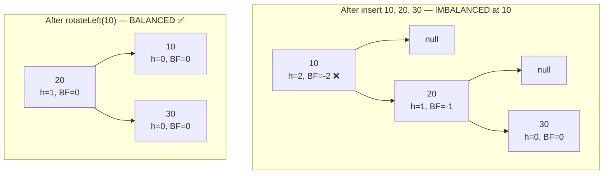

**Diagnosis:** Node 10: BF = -2 → Right heavy. Right child 20: BF = -1 → Right heavy (≤ 0). **→ RR Case → rotateLeft(10)**

---

## 4. Insert Case 3 — LR Rotation Triggered

**Sequence:** Insert 30, 10, 20

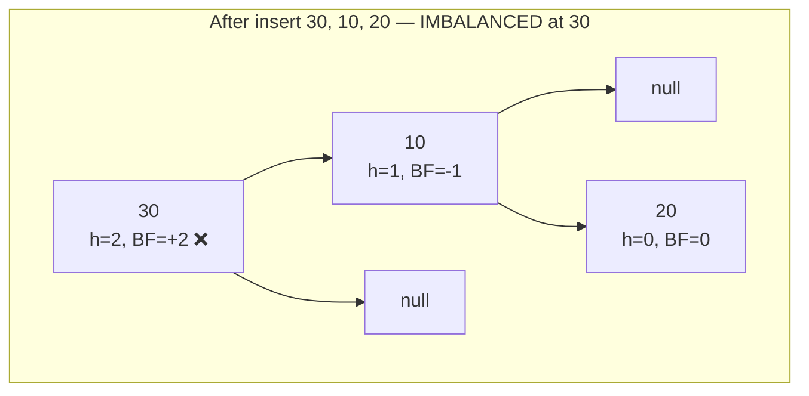

**Diagnosis:**
- Node 30: BF = +2 → Left heavy
- Left child 10: BF = -1 → Right heavy (**< 0**)
- **→ LR Case → rotateLeft(10), then rotateRight(30)**

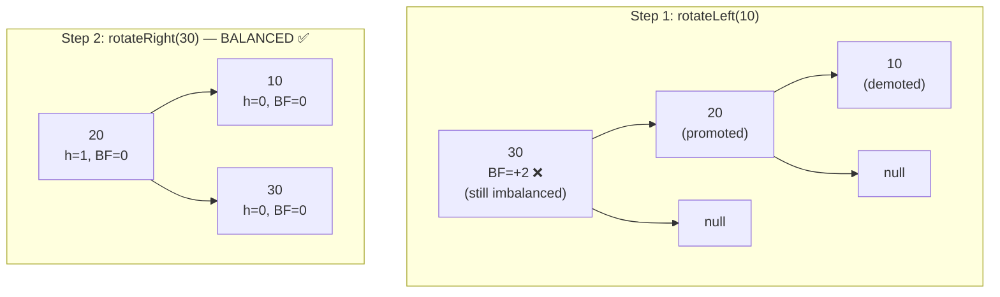

---

## 5. Insert Case 4 — RL Rotation Triggered

**Sequence:** Insert 10, 30, 20

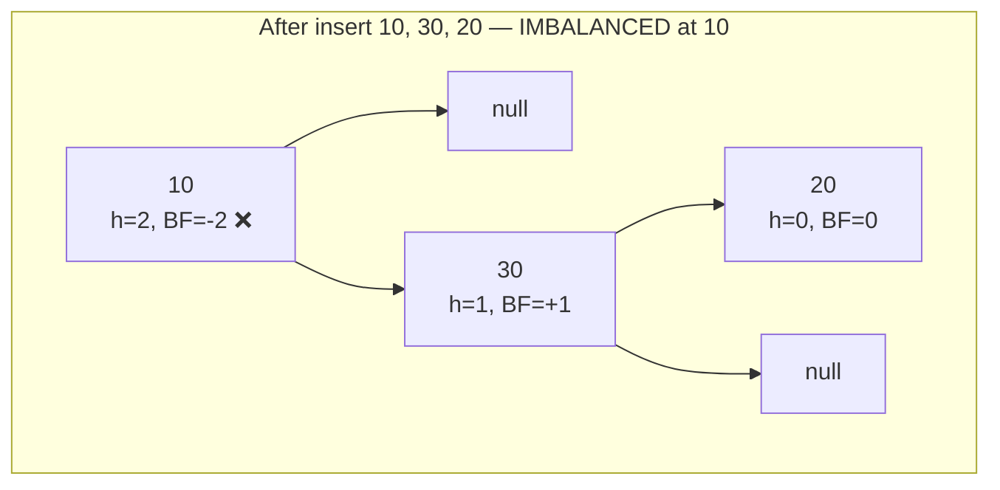

**Diagnosis:**
- Node 10: BF = -2 → Right heavy
- Right child 30: BF = +1 → Left heavy (**> 0**)
- **→ RL Case → rotateRight(30), then rotateLeft(10)**

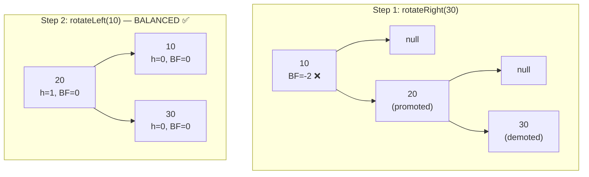

---

## 6. AVL Delete — The Algorithm

AVL deletion = BST deletion (same 3 cases) + rebalancing on the way back up.

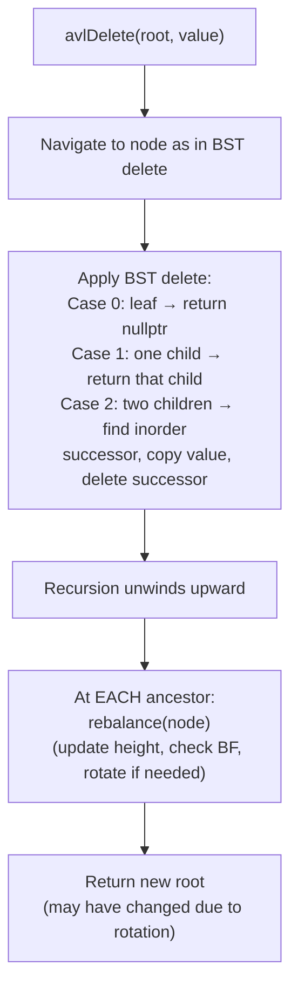

### Critical difference from insert

- After **insert**: at most **one** node in the tree becomes imbalanced, and at most **one** rotation fixes it.
- After **delete**: rebalancing one node can shift heights and cause **ancestors to become imbalanced too**. You must continue checking up the entire path to the root (up to O(log n) rotations).

```cpp
Node* avlDelete(Node* root, int value) {
    // ── Step 1: BST delete ─────────────────────────────────
    if (root == nullptr) return nullptr;

    if (value < root->data) {
        root->left  = avlDelete(root->left,  value);
    } else if (value > root->data) {
        root->right = avlDelete(root->right, value);
    } else {
        // Found the node to delete
        if (!root->left || !root->right) {
            // Case 0 (leaf) or Case 1 (one child)
            Node* child = root->left ? root->left : root->right;
            delete root;
            return child;   // nullptr for leaf, the one child otherwise
        }
        // Case 2: two children — find inorder successor
        Node* successor = root->right;
        while (successor->left) successor = successor->left;
        root->data  = successor->data;              // overwrite value
        root->right = avlDelete(root->right, successor->data);  // delete successor
    }

    // ── Step 2: Rebalance on the way back up ────────────────
    return rebalance(root);
}
```

---

## 7. Delete Walkthrough with Rebalancing

**Starting tree (AVL, balanced):**
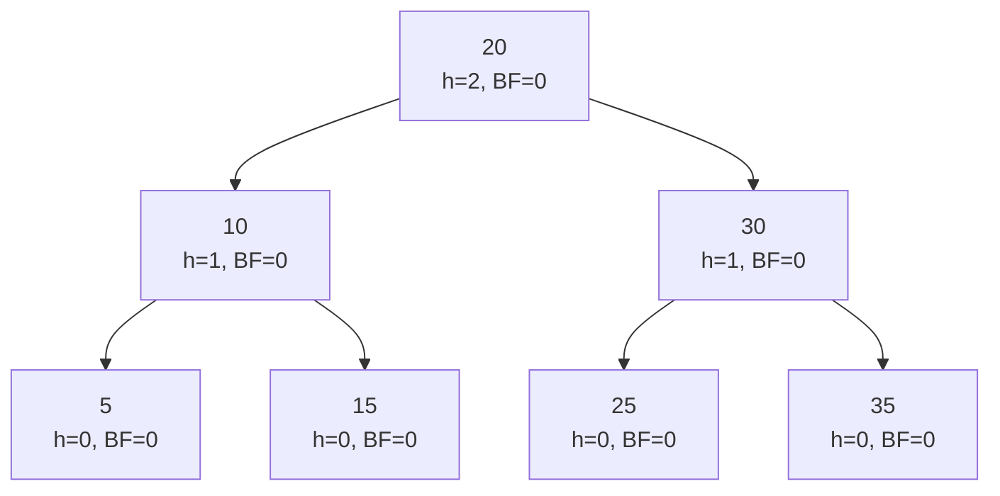

**Delete 5 (a leaf):**

```
avlDelete(root=20, 5):
  5 < 20 → avlDelete(root=10, 5)
    5 < 10 → avlDelete(root=5, 5)
      found! leaf → delete, return nullptr
    ← back at 10: root->left = nullptr
      rebalance(10): h(null)=-1, h(15)=0 → h(10)=1, BF=-1 → OK ✅
      return 10
  ← back at 20: root->left = 10 (unchanged)
    rebalance(20): h(10)=1, h(30)=1 → h(20)=2, BF=0 → OK ✅
    return 20
```

**Result — no rotation needed:**
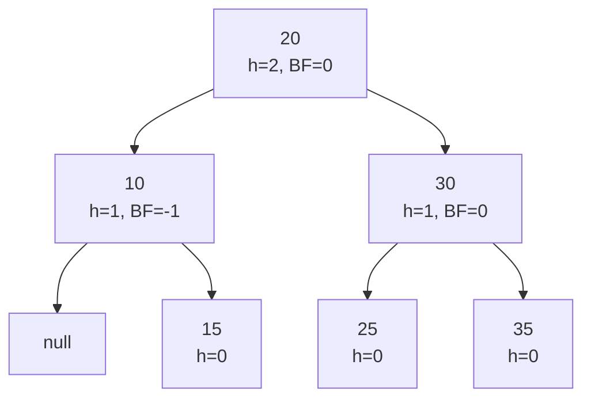

**Now delete 25 from this tree — watch rebalancing cascade:**

```
avlDelete(root=20, 25):
  25 > 20 → avlDelete(root=30, 25)
    25 < 30 → avlDelete(root=25, 25)
      found! leaf → delete, return nullptr
    ← back at 30: root->left = nullptr
      rebalance(30): h(null)=-1, h(35)=0 → h(30)=1, BF=-1 → OK ✅
      return 30
  ← back at 20: root->right = 30
    rebalance(20): h(10)=1, h(30)=1 → h=2, BF=0 → OK ✅
```

**Now imagine we also delete 15 and 35:**

After deleting 15: 10 has BF=-1 (only right side, but 15 was left...) actually let's do a case that triggers rotation.

**Scenario that triggers rotation on delete:**

Start fresh. Build this AVL tree by inserting: 50, 25, 75, 10, 30 (no right children of 75 inserted):

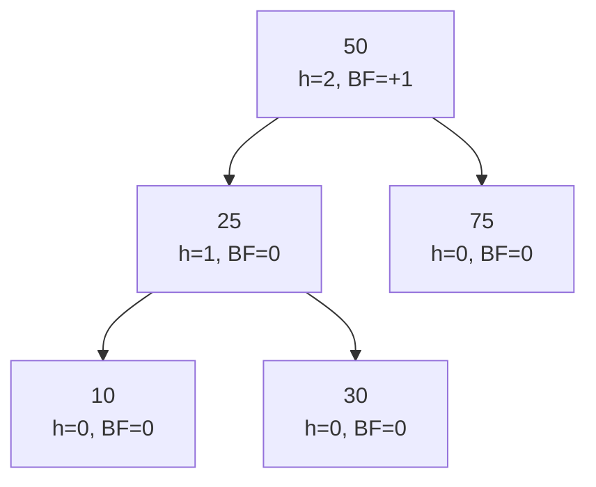

**Delete 75:**

```
avlDelete(50, 75):
  75 > 50 → avlDelete(75, 75): leaf → return nullptr
  ← back at 50: root->right = nullptr
    rebalance(50):
      h(left=25)=1, h(right=null)=-1 → h(50)=2, BF=1-(-1)=+2 ❌ LEFT HEAVY!
      Check left child (25): BF = h(10)-h(30) = 0-0 = 0 → BF ≥ 0 → LL Case!
      rotateRight(50):
        Y=25, T2=25->right=30
        25->right = 50
        50->left  = 30
        updateHeight(50): h(30)=0, h(null)=-1 → h(50)=1
        updateHeight(25): h(10)=0, h(50)=1    → h(25)=2
        return 25
```

**Result after rotation:**

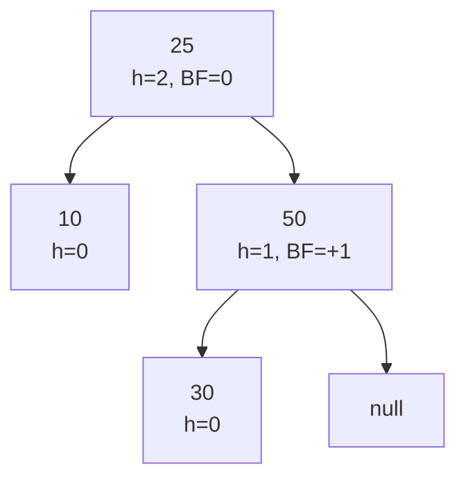

---

## 8. The Height-Update Order Problem

This is the subtlest correctness issue in AVL implementation. **Always update heights bottom-up.**

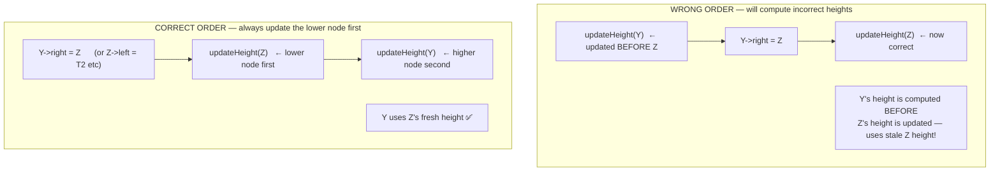

**Concrete example in rotateRight:**

```cpp
Node* rotateRight(Node* Z) {
    Node* Y  = Z->left;
    Node* T2 = Y->right;

    Y->right = Z;           // ← structural change
    Z->left  = T2;

    updateHeight(Z);        // ← Z first! Z is now lower (it lost T1, gained T2)
    updateHeight(Y);        // ← Y second. Y uses Z's freshly-computed height

    return Y;
}
```

If you do `updateHeight(Y)` before `updateHeight(Z)`, Y will compute its height using Z's OLD height (which is now wrong because Z's children changed). The resulting tree will have incorrect heights stored, causing future balance factor calculations to fail silently.

---

## 9. Complete C++ AVL Implementation

```cpp
#include <iostream>
#include <algorithm>
using namespace std;

// ════════════════════════════════════════════════════════════
//  NODE
// ════════════════════════════════════════════════════════════
struct Node {
    int data;
    Node* left;
    Node* right;
    int height;
    Node(int v) : data(v), left(nullptr), right(nullptr), height(0) {}
};

// ════════════════════════════════════════════════════════════
//  UTILITIES
// ════════════════════════════════════════════════════════════
int getHeight(Node* n)          { return n ? n->height : -1; }
int getBalance(Node* n)         { return n ? getHeight(n->left) - getHeight(n->right) : 0; }
void updateHeight(Node* n)      { if (n) n->height = 1 + max(getHeight(n->left), getHeight(n->right)); }

// ════════════════════════════════════════════════════════════
//  ROTATIONS
// ════════════════════════════════════════════════════════════
Node* rotateRight(Node* Z) {
    Node* Y = Z->left, *T2 = Y->right;
    Y->right = Z;  Z->left  = T2;
    updateHeight(Z); updateHeight(Y);
    return Y;
}

Node* rotateLeft(Node* Z) {
    Node* Y = Z->right, *T2 = Y->left;
    Y->left  = Z;  Z->right = T2;
    updateHeight(Z); updateHeight(Y);
    return Y;
}

// ════════════════════════════════════════════════════════════
//  REBALANCE — call after every structural change
// ════════════════════════════════════════════════════════════
Node* rebalance(Node* node) {
    updateHeight(node);
    int bf = getBalance(node);

    if (bf == 2) {   // Left heavy
        if (getBalance(node->left) >= 0)  return rotateRight(node);       // LL
        else { node->left = rotateLeft(node->left); return rotateRight(node); }  // LR
    }
    if (bf == -2) {  // Right heavy
        if (getBalance(node->right) <= 0) return rotateLeft(node);        // RR
        else { node->right = rotateRight(node->right); return rotateLeft(node); } // RL
    }
    return node;  // already balanced
}

// ════════════════════════════════════════════════════════════
//  INSERT
// ════════════════════════════════════════════════════════════
Node* insert(Node* root, int value) {
    if (!root) return new Node(value);
    if (value < root->data) root->left  = insert(root->left,  value);
    else if (value > root->data) root->right = insert(root->right, value);
    else return root;   // duplicate — no-op
    return rebalance(root);
}

// ════════════════════════════════════════════════════════════
//  FIND MINIMUM (inorder successor helper for delete)
// ════════════════════════════════════════════════════════════
Node* findMin(Node* node) {
    while (node->left) node = node->left;
    return node;
}

// ════════════════════════════════════════════════════════════
//  DELETE
// ════════════════════════════════════════════════════════════
Node* deleteNode(Node* root, int value) {
    if (!root) return nullptr;

    if (value < root->data) {
        root->left  = deleteNode(root->left,  value);
    } else if (value > root->data) {
        root->right = deleteNode(root->right, value);
    } else {
        // Node found
        if (!root->left || !root->right) {
            Node* child = root->left ? root->left : root->right;
            delete root;
            return child;
        }
        // Two children: find inorder successor, copy, delete successor
        Node* succ  = findMin(root->right);
        root->data  = succ->data;
        root->right = deleteNode(root->right, succ->data);
    }
    return rebalance(root);
}

// ════════════════════════════════════════════════════════════
//  SEARCH (same as BST — AVL is still a BST)
// ════════════════════════════════════════════════════════════
bool search(Node* root, int value) {
    if (!root) return false;
    if (root->data == value) return true;
    if (value < root->data) return search(root->left,  value);
    return search(root->right, value);
}

// ════════════════════════════════════════════════════════════
//  TRAVERSALS
// ════════════════════════════════════════════════════════════
void inorder(Node* root) {
    if (!root) return;
    inorder(root->left);
    cout << root->data << "(h=" << root->height
         << ",bf=" << getBalance(root) << ") ";
    inorder(root->right);
}

// ════════════════════════════════════════════════════════════
//  AVL PROPERTY VERIFICATION (for testing)
// ════════════════════════════════════════════════════════════
bool isAVL(Node* root) {
    if (!root) return true;
    int bf = getBalance(root);
    if (bf > 1 || bf < -1) {
        cout << "AVL VIOLATED at node " << root->data
             << " (bf=" << bf << ")\n";
        return false;
    }
    int computedH = 1 + max(getHeight(root->left), getHeight(root->right));
    if (root->height != computedH) {
        cout << "HEIGHT WRONG at node " << root->data
             << " (stored=" << root->height << " actual=" << computedH << ")\n";
        return false;
    }
    return isAVL(root->left) && isAVL(root->right);
}

// ════════════════════════════════════════════════════════════
//  MAIN — full demonstration
// ════════════════════════════════════════════════════════════
int main() {
    Node* root = nullptr;

    // Test 1: Sorted insertion (would degenerate plain BST)
    cout << "=== Sorted Insert 1..7 ===\n";
    for (int v : {1, 2, 3, 4, 5, 6, 7}) {
        root = insert(root, v);
        cout << "Inserted " << v << " → height=" << root->height
             << ", AVL valid=" << isAVL(root) << "\n";
    }
    cout << "Inorder: "; inorder(root); cout << "\n";
    cout << "Root: " << root->data << " (expected 4 — rotations kept it balanced)\n\n";

    // Test 2: Delete operations
    cout << "=== Delete 3 (leaf after rotations) ===\n";
    root = deleteNode(root, 3);
    cout << "After delete 3: "; inorder(root); cout << "\n";
    cout << "AVL valid: " << isAVL(root) << "\n\n";

    cout << "=== Delete 4 (root, two children) ===\n";
    root = deleteNode(root, 4);
    cout << "After delete 4: "; inorder(root); cout << "\n";
    cout << "AVL valid: " << isAVL(root) << "\n\n";

    // Test 3: Reverse sorted (also degenerates plain BST)
    cout << "=== Reverse Sorted Insert 7..1 ===\n";
    Node* root2 = nullptr;
    for (int v : {7, 6, 5, 4, 3, 2, 1}) {
        root2 = insert(root2, v);
    }
    cout << "Root: " << root2->data << " (expected 4)\n";
    cout << "Height: " << root2->height << " (expected 2)\n";
    cout << "AVL valid: " << isAVL(root2) << "\n";

    return 0;
}
```

---

## 10. Complexity Analysis

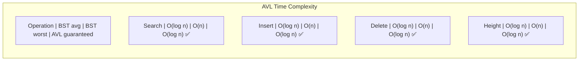

| Operation | BST Average | BST Worst | AVL Guaranteed |
|---|---|---|---|
| Search | O(log n) | O(n) | **O(log n)** |
| Insert | O(log n) | O(n) | **O(log n)** |
| Delete | O(log n) | O(n) | **O(log n)** |
| Space | O(n) | O(n) | **O(n)** |
| Max height | — | n-1 | **1.44 log n** |

### Where does the O(log n) come from?

```
Insert path:    O(log n) nodes visited on the way down
Height updates: O(log n) nodes updated on the way back up
Rotations:      At most 1 rotation (insert), up to O(log n) (delete)
Each rotation:  O(1) — just pointer swaps + 2 height updates
Total:          O(log n) × O(1) = O(log n)
```

### The overhead of AVL vs plain BST

AVL pays a constant-factor overhead per operation:
- 1 extra integer stored per node (`height`)
- Height update + BF check at each ancestor on unwind (O(1) per node, O(log n) total)
- Occasional O(1) rotation

For sorted workloads, AVL is O(log n) while BST is O(n) — **AVL wins by an enormous margin.** For random workloads, the overhead is a small constant factor. In practice, you should prefer AVL (or Red-Black Tree) any time you can't guarantee random input order.

---

## 11. AVL vs BST Comparison

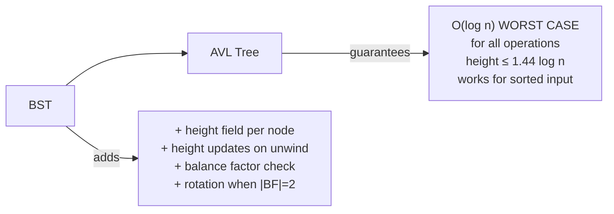

| Feature | BST | AVL |
|---|---|---|
| Is it a BST? | Yes | **Yes — AVL IS a BST** |
| Worst case height | n-1 | 1.44 log n |
| Search worst case | O(n) | O(log n) |
| Insert worst case | O(n) | O(log n) |
| Delete worst case | O(n) | O(log n) |
| Extra memory | None | 1 int per node (height) |
| Implementation complexity | Simple | Moderate |
| Rotations after insert | 0 | 0 or 1 |
| Rotations after delete | 0 | 0 to O(log n) |
| Best for | Small trees, random input | Sorted input, lookup-heavy workloads |

---

## Summary — AVL in 10 Lines of Intuition

```
1. AVL = BST + self-balancing
2. Every node stores height (enables O(1) balance check)
3. Balance Factor BF = h(left) - h(right). Must be in {-1, 0, +1}
4. After insert/delete, unwind upward checking BF
5. If |BF| = 2: imbalanced → apply rotation
6. BF=+2, left child BF≥0  → LL → rotateRight
7. BF=+2, left child BF<0  → LR → rotateLeft(child), rotateRight
8. BF=-2, right child BF≤0 → RR → rotateLeft
9. BF=-2, right child BF>0 → RL → rotateRight(child), rotateLeft
10. Result: height ≤ 1.44 log n, ALL ops O(log n) guaranteed
```
