# Heaps — Complete Deep Dive
## Array Representation, Heapify, HeapSort, and the Bridge to Graph Algorithms

---

## Table of Contents
1. [What Is a Heap?](#1-what-is-a-heap)
2. [Why an Array? — The Index Math](#2-why-an-array--the-index-math)
3. [Max Heap vs Min Heap](#3-max-heap-vs-min-heap)
4. [Heapify (Sift Down) — The Core Operation](#4-heapify-sift-down--the-core-operation)
5. [BuildMaxHeap — Why O(n) Not O(n log n)](#5-buildmaxheap--why-on-not-on-log-n)
6. [HeapSort — Full Step-by-Step Walkthrough](#6-heapsort--full-step-by-step-walkthrough)
7. [Your main.cpp — The Weird Post-Sort Traversal Explained](#7-your-maincpp--the-weird-post-sort-traversal-explained)
8. [STL priority_queue — The Bridge to Dijkstra](#8-stl-priority_queue--the-bridge-to-dijkstra)

---

## 1. What Is a Heap?

A **heap** is a **complete binary tree** that satisfies the **heap property**. Two things to internalize:

**Complete binary tree:** Every level is fully filled except possibly the last level, which is filled from left to right. No gaps in the middle.

**Heap property:** Every parent is "better" than both its children. "Better" means ≥ (max heap) or ≤ (min heap).

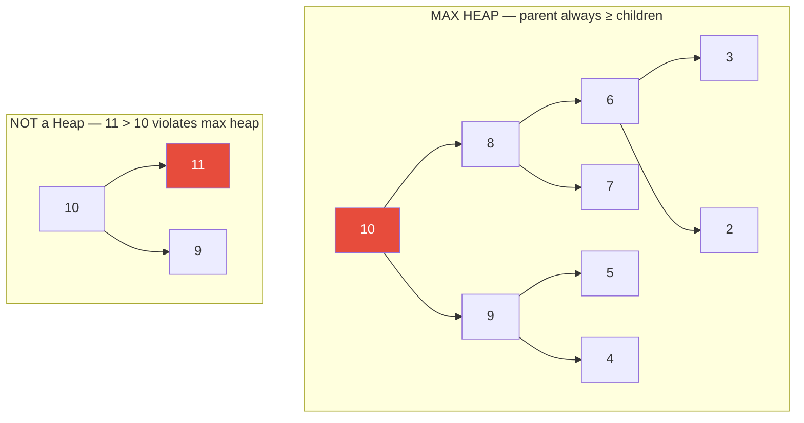

**Key insight:** A heap does NOT guarantee left-to-right order among siblings, and it does NOT guarantee the second-largest element is in any particular spot (unlike BST). The heap only guarantees **parent ≥ children** at every node. The global maximum is **always at the root** — that's its power.

---

## 2. Why an Array? — The Index Math

A complete binary tree has a beautiful property: it can be stored in an array with **zero wasted space and no pointers**, using simple index arithmetic.

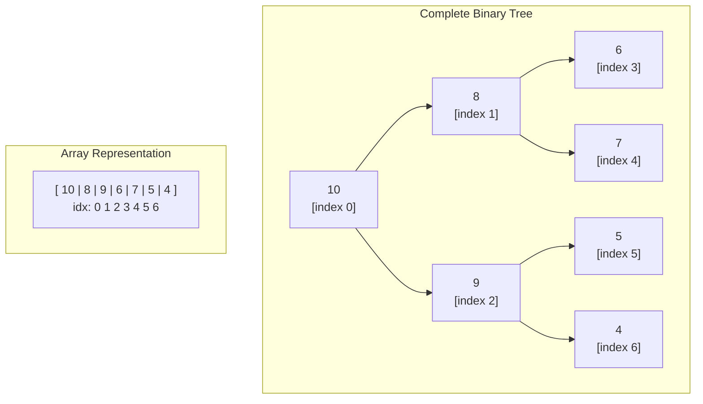

### The Formulas — Memorize These

For any node at index `i`:

```
Left child  = 2*i + 1
Right child = 2*i + 2
Parent      = (i - 1) / 2    (integer division)
```

### Proof by example:

```
Node at index 0 (root = 10):
  Left child:  2*0 + 1 = 1  → arr[1] = 8  ✅
  Right child: 2*0 + 2 = 2  → arr[2] = 9  ✅

Node at index 1 (8):
  Left child:  2*1 + 1 = 3  → arr[3] = 6  ✅
  Right child: 2*1 + 2 = 4  → arr[4] = 7  ✅
  Parent:      (1-1)/2  = 0  → arr[0] = 10 ✅

Node at index 3 (6):
  Left child:  2*3 + 1 = 7  → arr[7] = out of bounds (no children) ✅
  Parent:      (3-1)/2  = 1  → arr[1] = 8  ✅
```

### Why This Works (The Math Intuition)

Level 0 has 1 node (root, index 0).
Level 1 has 2 nodes (indices 1, 2).
Level 2 has 4 nodes (indices 3, 4, 5, 6).
Level k starts at index `2^k - 1`.

The left child of node `i` is at `2i + 1` because:
- Node `i` is at some position within its level
- Its two children are at positions `2i` and `2i + 1` in the NEXT level
- The `+1` offsets because the array is 0-indexed

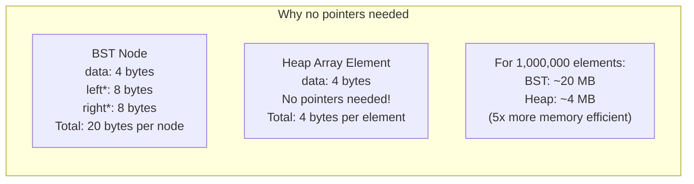

### Last Non-Leaf Node

An important formula: the index of the last non-leaf node is `(size/2) - 1`.

Why? The last element is at index `size-1`. Its parent is at `(size-1-1)/2 = (size-2)/2 = size/2 - 1` (integer division). So the last non-leaf is at `size/2 - 1`. Every index before that is also a non-leaf; every index after is a leaf.

**For array of size 10: last non-leaf = 10/2 - 1 = 4.** Indices 0-4 have children; 5-9 are leaves.

---

## 3. Max Heap vs Min Heap

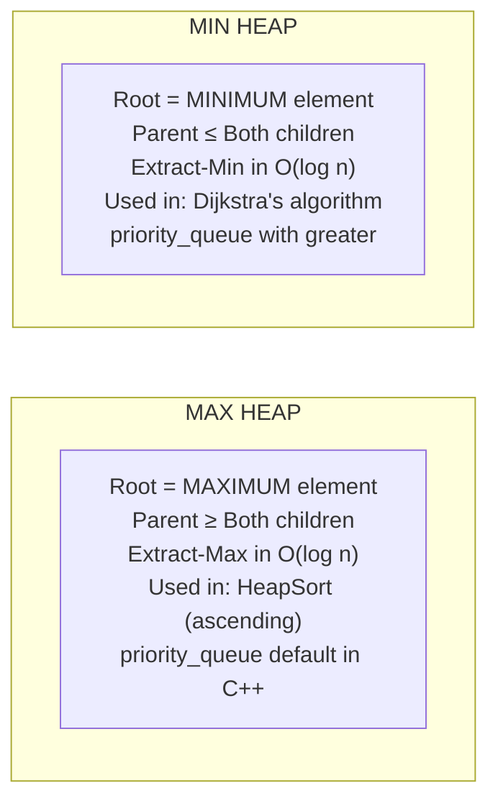

**For graphs, you almost always want a MIN HEAP** — Dijkstra's needs the node with the smallest distance first. C++ `priority_queue` is a max heap by default. To get a min heap:

```cpp
// Max heap (default):
priority_queue<int> maxPQ;

// Min heap:
priority_queue<int, vector<int>, greater<int>> minPQ;

// Min heap with pairs (for Dijkstra):
priority_queue<pair<int,int>, vector<pair<int,int>>, greater<pair<int,int>>> dijkstraPQ;
```

---

## 4. Heapify (Sift Down) — The Core Operation

`Heapify` is the operation that **restores the heap property at a given node**, assuming both its subtrees are already valid heaps.

### The Algorithm

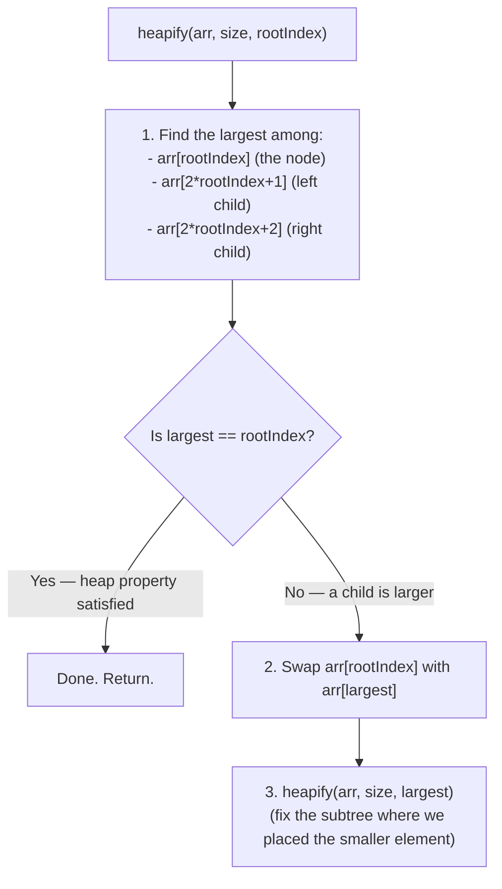

### Your Code

```cpp
void Heapify(Node* BinaryTree[], int size, int rootIndex) {
    int largest = rootIndex;                // assume current node is largest
    int leftChild  = 2 * rootIndex + 1;
    int rightChild = 2 * rootIndex + 2;

    // Is left child larger than current largest?
    if (leftChild < size && BinaryTree[leftChild]->data > BinaryTree[largest]->data) {
        largest = leftChild;
    }
    // Is right child larger than current largest?
    if (rightChild < size && BinaryTree[rightChild]->data > BinaryTree[largest]->data) {
        largest = rightChild;
    }

    if (largest != rootIndex) {             // a child is larger — swap and recurse
        swap(BinaryTree[rootIndex], BinaryTree[largest]);
        Heapify(BinaryTree, size, largest); // fix the subtree we disturbed
    }
}
```

### Heapify Walkthrough — Single Call

Array: `[3, 9, 2, 1, 4, 5, 8, 7, 6, 10]`

Let's heapify at index 0 (value=3), assuming children are already valid heaps:

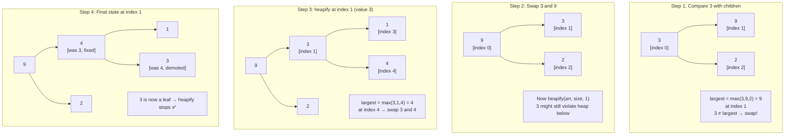

**Time complexity:** O(log n) — in the worst case, the element sifts all the way down from root to leaf, and the tree height is log n.

---

## 5. BuildMaxHeap — Why O(n) Not O(n log n)

`BuildMaxHeap` converts an arbitrary array into a valid max heap.

### The Algorithm

```cpp
void BuildMaxHeap(Node* BinaryTree[], int size) {
    int index = (size / 2) - 1;   // start from last non-leaf
    while (index >= 0) {
        Heapify(BinaryTree, size, index);
        index--;
    }
}
```

**Why start from the last non-leaf?** Leaves are already valid heaps (size-1 subtrees). You only need to call Heapify on nodes that have children. Starting from the bottom non-leaf and working upward ensures that when you call Heapify on node i, both its subtrees are already valid heaps (the precondition for Heapify to work correctly).

**Why not start from the root?** Going top-down would mean when you Heapify the root, its children may not yet be valid heaps — Heapify's precondition would be violated.

### BuildMaxHeap on Your Array: `[3, 9, 2, 1, 4, 5, 8, 7, 6, 10]` (size=10)

```
Last non-leaf = 10/2 - 1 = 4

Step index=4 (value=4): children = arr[9]=10, arr[10]=OOB
  largest = 10 at index 9 → swap 4 and 10
  Array: [3, 9, 2, 1, 10, 5, 8, 7, 6, 4]
  heapify at 9 (leaf) → done

Step index=3 (value=1): children = arr[7]=7, arr[8]=6
  largest = 7 at index 7 → swap 1 and 7
  Array: [3, 9, 2, 7, 10, 5, 8, 1, 6, 4]
  heapify at 7 (leaf) → done

Step index=2 (value=2): children = arr[5]=5, arr[6]=8
  largest = 8 at index 6 → swap 2 and 8
  Array: [3, 9, 8, 7, 10, 5, 2, 1, 6, 4]
  heapify at 6 (leaf) → done

Step index=1 (value=9): children = arr[3]=7, arr[4]=10
  largest = 10 at index 4 → swap 9 and 10
  Array: [3, 10, 8, 7, 9, 5, 2, 1, 6, 4]
  heapify at 4: children = arr[9]=4, arr[10]=OOB
    largest = max(9,4) = 9 at index 4 → no swap
  done

Step index=0 (value=3): children = arr[1]=10, arr[2]=8
  largest = 10 at index 1 → swap 3 and 10
  Array: [10, 3, 8, 7, 9, 5, 2, 1, 6, 4]
  heapify at 1 (value=3): children = arr[3]=7, arr[4]=9
    largest = 9 at index 4 → swap 3 and 9
    Array: [10, 9, 8, 7, 3, 5, 2, 1, 6, 4]
    heapify at 4 (value=3): children = arr[9]=4, arr[10]=OOB
      largest = max(3,4) = 4 at index 9 → swap 3 and 4
      Array: [10, 9, 8, 7, 4, 5, 2, 1, 6, 3]
      heapify at 9 (leaf) → done
```

**Final Max Heap:** `[10, 9, 8, 7, 4, 5, 2, 1, 6, 3]`

### Why Is BuildMaxHeap O(n)?

Naively: `n/2 calls to Heapify, each O(log n)` = O(n log n). But this is a loose bound.

The tight analysis: nodes at height h can sift down at most h levels. There are at most `n / 2^(h+1)` nodes at height h. Total work = `Σ (n/2^(h+1)) * h` for h from 0 to log n. This geometric series sums to `O(n)`. Most nodes are near the bottom and do very little work.

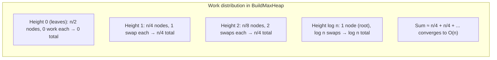

---

## 6. HeapSort — Full Step-by-Step Walkthrough

HeapSort exploits a brilliant observation: the maximum element is always at the root. Extract it, put it at the end, shrink the heap, restore the heap property, repeat.

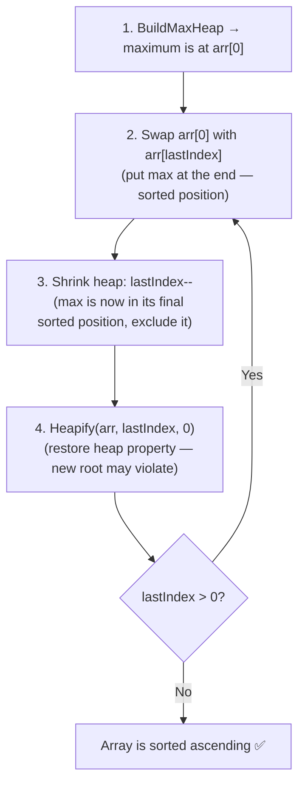

### Your Code

```cpp
void HeapSort(Node* BinaryTree[], int size) {
    BuildMaxHeap(BinaryTree, size);   // Phase 1: build max heap

    int lastIndex = size - 1;
    int rootIndex = 0;

    while (lastIndex > rootIndex) {
        // Swap root (max) with last unsorted element
        swap(BinaryTree[rootIndex], BinaryTree[lastIndex]);

        lastIndex--;   // shrink heap — sorted section grows from right

        Heapify(BinaryTree, lastIndex, rootIndex);  // restore heap, only on unsorted section
    }
}
```

### Full Walkthrough on `[3, 9, 2, 1, 4, 5, 8, 7, 6, 10]`

```
After BuildMaxHeap:  [10, 9, 8, 7, 4, 5, 2, 1, 6, 3]
                      ^max                          ^
Iteration 1: Swap arr[0]=10 with arr[9]=3
  Array: [3, 9, 8, 7, 4, 5, 2, 1, 6 | 10]
                                      ^^^sorted
  Heapify first 9 elements from index 0:
  3→9→9 is max at [1]→swap → [9,3,8,7,4,5,2,1,6 | 10]
  3→7,4 → 7 is max at [3]→swap → [9,7,8,3,4,5,2,1,6 | 10]
  3→1,6 → 6 is max at [8]→swap → [9,7,8,3,4,5,2,1,6... wait, recalculate]

  Actually, step by step heapify for size=9, index=0, value=3:
  left=1(9), right=2(8): largest=1(9) → swap(0,1): [9,3,8,7,4,5,2,1,6 | 10]
  heapify at 1, value=3: left=3(7), right=4(4): largest=3(7) → swap(1,3): [9,7,8,3,4,5,2,1,6 | 10]
  heapify at 3, value=3: left=7(1), right=8(6): largest=8(6) → swap(3,8): [9,7,8,6,4,5,2,1,3 | 10]
  heapify at 8, value=3: no children in size-9 heap → done

  Heap: [9, 7, 8, 6, 4, 5, 2, 1, 3 | 10]

Iteration 2: Swap arr[0]=9 with arr[8]=3
  Array: [3, 7, 8, 6, 4, 5, 2, 1 | 9, 10]
  Heapify size=8 from 0: 3→7,8: 8 largest → swap: [8,7,3,6,4,5,2,1|9,10]
  3→2(OOB size=8?no, left=5,right=6): 5(arr[5])=5, 6(arr[6])=2: largest=5→swap: [8,7,5,6,4,3,2,1|9,10]
  heapify at 5 (value=3): children=10,11 both OOB for size=8 → done
  Heap: [8, 7, 5, 6, 4, 3, 2, 1 | 9, 10]

... (continues until all elements moved to sorted section)

Final: [1, 2, 3, 4, 5, 6, 7, 8, 9, 10]  (sorted ascending ✅)
```

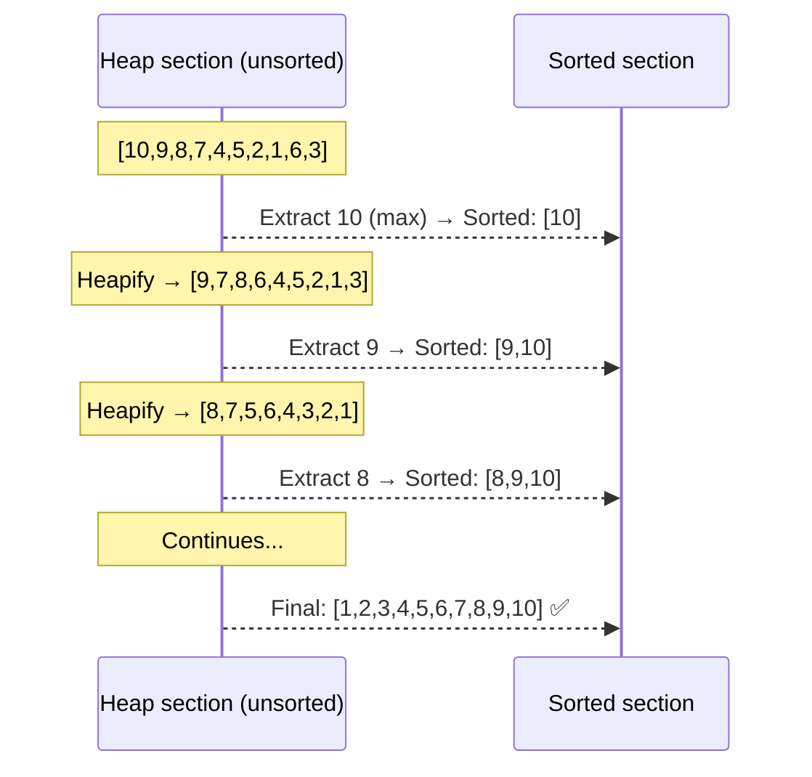

**Time Complexity:** O(n log n) — BuildMaxHeap is O(n), then n extractions each costing O(log n).
**Space Complexity:** O(1) — sorted in place, no extra array needed.
**Note:** HeapSort is NOT stable (equal elements may reorder). Quicksort is usually faster in practice due to cache behavior.

---

## 7. Your main.cpp — The Weird Post-Sort Traversal Explained

You noticed something strange: after HeapSort, the tree traversals give unexpected results. Let's understand why.

```cpp
HeapSort(BinaryTree, size);

cout << "Sorted Binary Tree: ";
for(int i = 0; i < size; i++){
    cout << BinaryTree[i]->data << " ";   // 1 2 3 4 5 6 7 8 9 10 ✅ (correct!)
}

cout << "In-order traversal: ";
printInOrder(BinaryTree, 0, size);        // 8 4 9 2 10 5 1 6 3 7  ← looks weird!
```

**Why the traversal looks wrong:** After HeapSort, the array is sorted in ascending order — `[1, 2, 3, 4, 5, 6, 7, 8, 9, 10]`. But the array-to-tree mapping still uses the index formulas. So the "tree" now has:

```
arr[0]=1 (root)
arr[1]=2 (left of 1), arr[2]=3 (right of 1)
arr[3]=4 (left of 2), arr[4]=5 (right of 2)
arr[5]=6 (left of 3), arr[6]=7 (right of 3)
arr[7]=8 (left of 4), arr[8]=9 (right of 4), arr[9]=10 (left of 5)
```

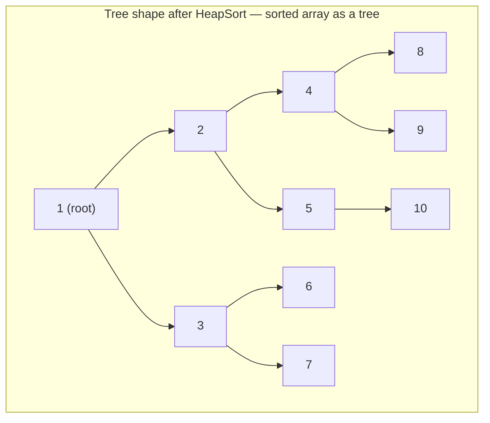

This is NOT a BST! The sorted array treated as a complete binary tree gives a structure where parents are smaller than children — this is a **MIN HEAP** structure, not a BST. So inorder traversal gives a weird order (8, 4, 9, 2, 10, 5, 1, 6, 3, 7) because the tree structure itself is not ordered by BST rules.

**The point:** `printInOrder` on an array-based heap doesn't give sorted output — that's a BST property, not a heap property. The sorted output comes from the flat array traversal, not from tree traversal of the heap.

---

## 8. STL priority_queue — The Bridge to Dijkstra

The C++ `priority_queue` is a heap under the hood. This is the data structure you'll use in Dijkstra's, Prim's, and anywhere you need "always give me the minimum/maximum" efficiently.

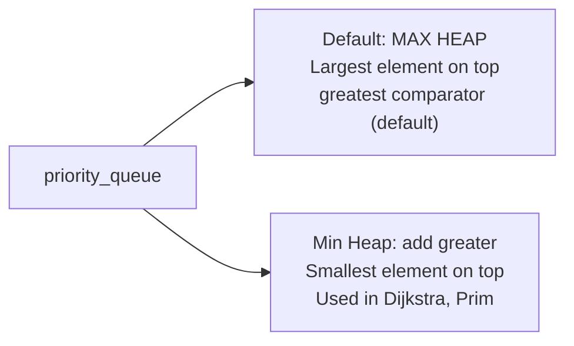

### API — What You'll Actually Use

```cpp
#include <queue>
using namespace std;

// MAX HEAP (default)
priority_queue<int> pq;
pq.push(5);          // insert — O(log n)
pq.push(3);
pq.push(8);
pq.top();            // peek max → 8 — O(1)
pq.pop();            // remove max → O(log n)
pq.empty();          // check if empty — O(1)
pq.size();           // number of elements — O(1)

// MIN HEAP
priority_queue<int, vector<int>, greater<int>> minPQ;
minPQ.push(5);
minPQ.push(3);
minPQ.push(8);
minPQ.top();         // → 3 (minimum!)
```

### For Dijkstra — Pairs in Priority Queue

```cpp
// {distance, vertex} pairs — sorted by distance (first element)
priority_queue<
    pair<int,int>,          // element type: {distance, vertex}
    vector<pair<int,int>>,  // underlying container (always vector)
    greater<pair<int,int>>  // comparator: min heap (smallest distance first)
> pq;

pq.push({0, src});    // {distance=0, source vertex}
pq.push({5, 3});      // vertex 3 is distance 5 away

auto [dist, vertex] = pq.top();  // structured binding (C++17)
pq.pop();
// dist=0, vertex=src (minimum distance first)
```

### Custom Objects in Priority Queue

```cpp
// For more complex scenarios:
struct State {
    int cost, node;
    bool operator>(const State& other) const {
        return cost > other.cost;   // for min heap: greater cost = lower priority
    }
};

priority_queue<State, vector<State>, greater<State>> pq;
pq.push({0, src});
State cur = pq.top(); pq.pop();
```

### Connection to Your Heap Code

Your `main.cpp` manually implements what `priority_queue` does internally. The STL version is:
- More memory efficient (stores values, not Node pointers)
- Handles the index math and heapify internally
- Ready to use with zero setup for interviews/exams

```cpp
// Your manual heap approach (array of Node pointers):
Node* BinaryTree[10];
BuildMaxHeap(BinaryTree, 10);
// Swap root and last, heapify, repeat...

// STL approach (what you'll use in graph algorithms):
priority_queue<int> pq;
pq.push(10); pq.push(9); // etc.
while (!pq.empty()) {
    int top = pq.top(); pq.pop();  // always gives max
}
```

### Why Heap is O(log n) for Insert and Extract

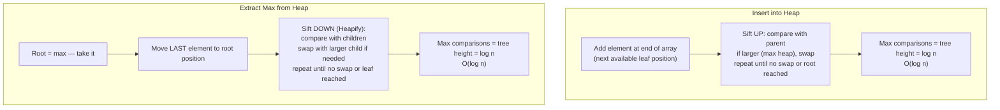

---

## Summary and Comparison

```
HEAP PROPERTIES:
  Complete binary tree — fills levels left to right, no gaps
  Heap property — parent ≥ children (max) or parent ≤ children (min)
  Root = global maximum (max heap) or minimum (min heap)
  NOT a BST — no left/right ordering guarantee

ARRAY STORAGE:
  Left child of i  = 2i + 1
  Right child of i = 2i + 2
  Parent of i      = (i-1) / 2
  Last non-leaf    = size/2 - 1

COMPLEXITIES:
  Heapify (sift down): O(log n)
  BuildMaxHeap:        O(n)     ← surprisingly not O(n log n)!
  HeapSort:            O(n log n) time, O(1) space (in-place)
  Insert:              O(log n)
  Extract max/min:     O(1) to peek, O(log n) to remove

STL PRIORITY QUEUE:
  priority_queue<T>                              → max heap
  priority_queue<T, vector<T>, greater<T>>       → min heap
  push() → O(log n), top() → O(1), pop() → O(log n)
  For Dijkstra: priority_queue<pair<int,int>, vector<pair<int,int>>, greater<...>>

YOUR CODE:
  main.cpp stores Node* in an array — unusual but correct
  After HeapSort, array is sorted but the tree representation is NOT a BST
  printInOrder after sort gives weird output because sorted array ≠ valid BST
```

---

## What's Next — Heaps in Graph Algorithms

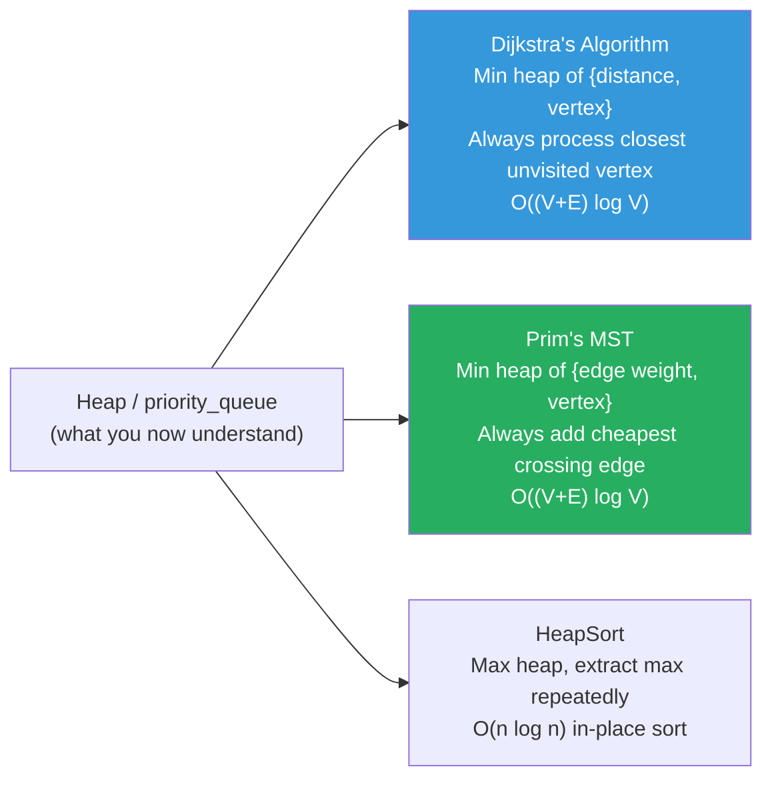

Every graph algorithm that needs "always give me the best option" uses a heap. Your deep understanding of how Heapify and BuildMaxHeap work is exactly the foundation that makes Dijkstra's algorithm intuitive — it's the same sift-up/sift-down logic, just applied to graph vertices keyed by their shortest-path distance.
