# Tree Memory Model & Foundations
## How Trees Actually Live in RAM — The Deep Intuition

---

## Table of Contents
1. [What a Node Really Is in Memory](#1-what-a-node-really-is-in-memory)
2. [Why `Node*` Is Just a Number](#2-why-node-is-just-a-number)
3. [Stack vs Heap — Where Your Nodes Live](#3-stack-vs-heap--where-your-nodes-live)
4. [The Three Pointer Signatures — and When to Use Each](#4-the-three-pointer-signatures--and-when-to-use-each)
5. [The Return-and-Rewire Pattern](#5-the-return-and-rewire-pattern)
6. [NULL vs nullptr — and What a Crash Looks Like](#6-null-vs-nullptr--and-what-a-crash-looks-like)
7. [Tree Properties and Math Theorems](#7-tree-properties-and-math-theorems)
8. [Your Code Through the Memory Lens](#8-your-code-through-the-memory-lens)

---

## 1. What a Node Really Is in Memory

When you write this struct:

```cpp
struct Node {
    int data;    // 4 bytes
    Node* left;  // 8 bytes (64-bit address)
    Node* right; // 8 bytes (64-bit address)
};
```

You are describing a **20-byte block of RAM** with three slots. Every time you call `new Node`, the OS gives you a fresh 20-byte block somewhere in heap memory and hands you its address.

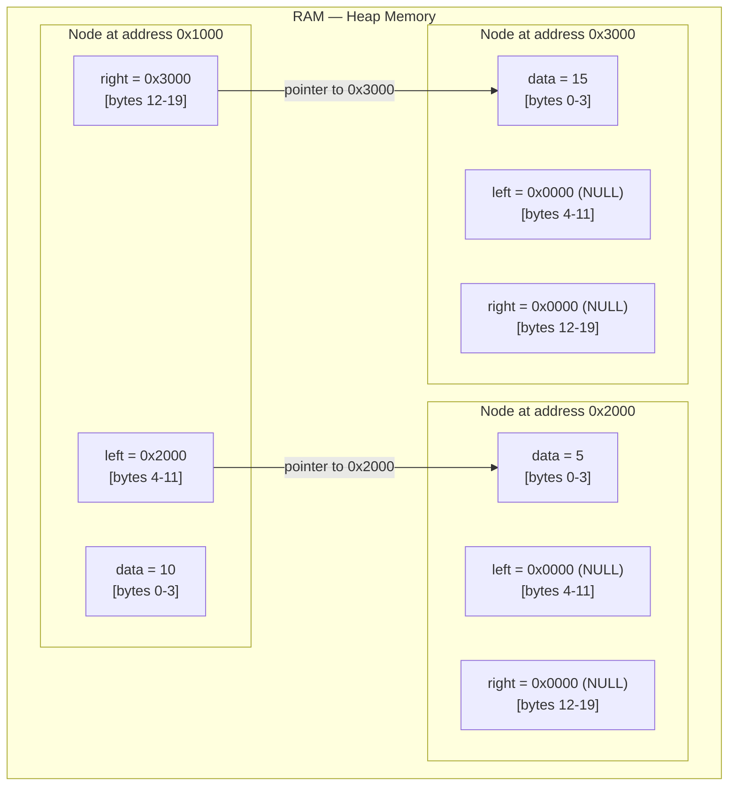

The "tree" you draw on paper with boxes and arrows **does not exist as a shape in RAM**. RAM is a flat list of addresses. What exists is a chain of 20-byte blocks, where some of the bytes inside each block are **addresses pointing to other blocks**. The tree shape is an abstraction that emerges from following those addresses.

---

## 2. Why `Node*` Is Just a Number

A pointer is not magic. It is a variable that holds an **integer** — specifically, a memory address.

```cpp
Node* root = new Node();  
// root holds a value like: 0x55a3f2c01eb0
// That number is the address of the Node in heap memory

cout << root;       // prints: 0x55a3f2c01eb0  (the address itself)
cout << root->data; // follows the address, reads 4 bytes there
cout << *root;      // dereferences — gives you the whole Node struct
```

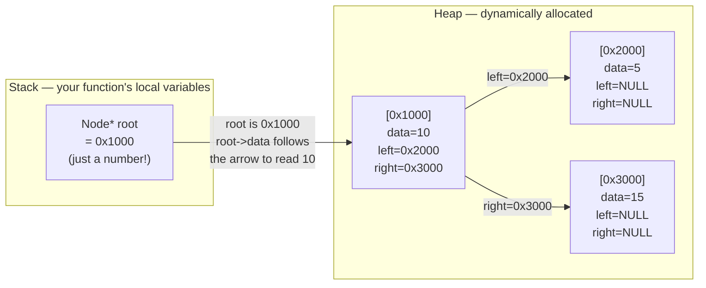

This is why:
- **Copying a pointer is cheap** — you're just copying a number. The actual Node is not copied.
- **Passing a pointer to a function** lets the function see the original Node — because both sides hold the same address.
- **Setting a pointer to NULL** doesn't delete the node — it just makes the variable hold 0 instead of the old address. The node in heap memory is still sitting there, leaking, until you `delete` it.

---

## 3. Stack vs Heap — Where Your Nodes Live

This distinction is critical for understanding your tree code.

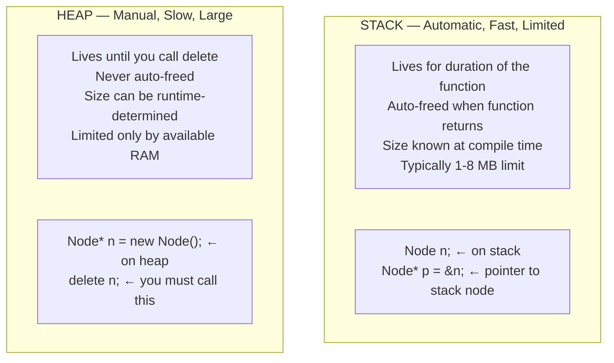

### In your BST code:

```cpp
// This is in your createNode function:
node = new Node;       // ← HEAP allocation
node->data = value;    // ← writing into that heap block
node->left = NULL;     // ← setting the pointer slots to zero
node->right = NULL;
```

```cpp
// In your BinarySearchTree struct:
BinarySearchTree bst;   // ← bst itself is on STACK
bst.root = NULL;        // ← root is a pointer, currently holding 0 (NULL)
```

The `bst` variable lives on the stack. But every `Node` you insert via `new` lives on the heap. The `bst.root` pointer (a stack variable) holds the **address** of a heap block. Following the tree means jumping from heap block to heap block by following the address fields.

### What happens without `delete`

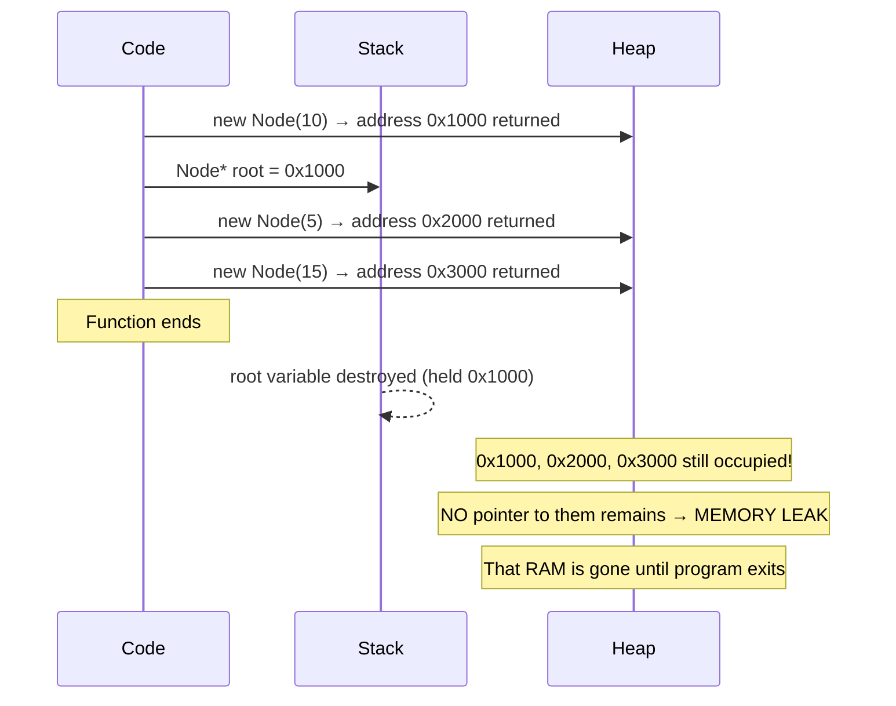

Your current BST code has **no destructor and no delete calls** — meaning every node you insert leaks. For a student project this is fine. For production code, you'd add a recursive delete in the destructor:

```cpp
void destroyTree(Node* node) {
    if (!node) return;
    destroyTree(node->left);   // delete children first
    destroyTree(node->right);
    delete node;               // then delete self
}
```

---

## 4. The Three Pointer Signatures — and When to Use Each

This is the biggest source of confusion when reading tree code. There are **three ways** a function can receive a pointer:

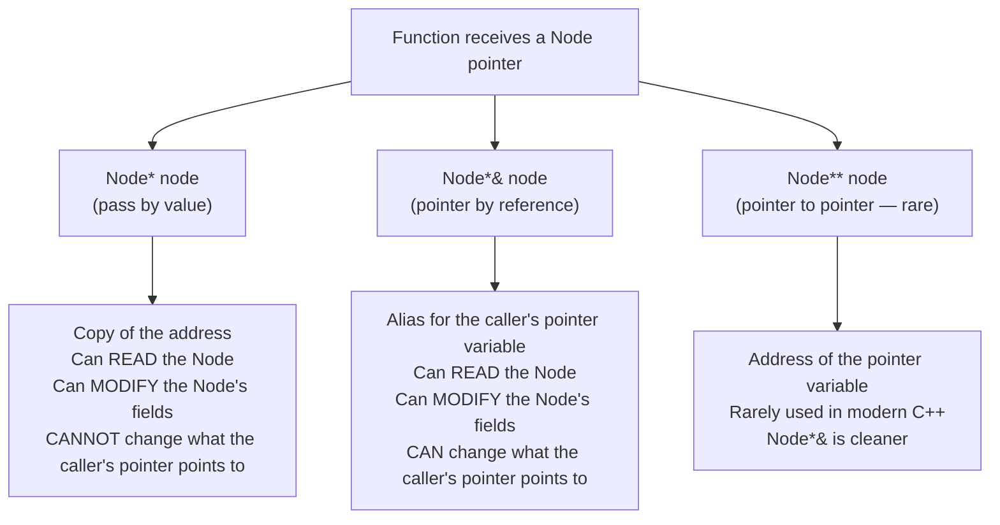

### Concrete demonstration with your code:

```cpp
// YOUR insertNode uses Node*& — this is intentional and necessary
void insertNode(Node*& node, int value) {
    if (node == NULL) {
        createNode(node, value);  // ← node = new Node works because node is a REFERENCE
        return;
    }
    // ...
}
```

**Why `Node*&` is required here:** When you find the empty spot (NULL), you do `node = new Node`. This changes **where the pointer points**. If you used `Node*` (by value), this assignment would change a local copy and the caller's pointer would remain NULL — the node would be created and immediately lost.

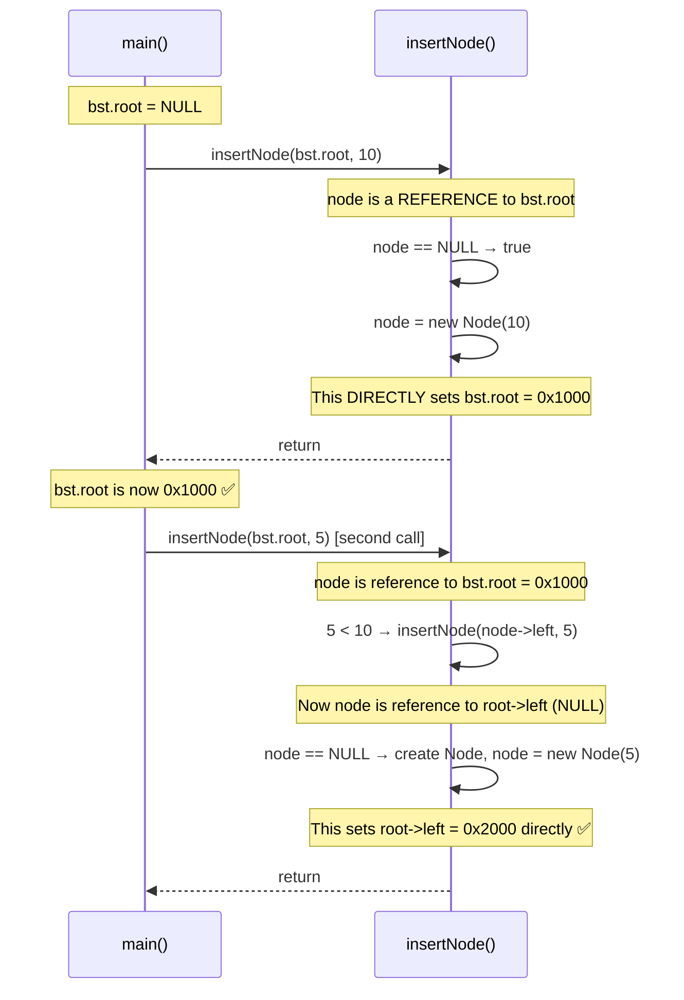

**If you had used `Node*` instead of `Node*&`:**

```cpp
// BROKEN version with Node* (value — a copy)
void insertNode(Node* node, int value) {
    if (node == NULL) {
        createNode(node, value);  // node is a LOCAL copy — this is lost!
        return;                   // caller's pointer is still NULL
    }
}
```

The tree would never grow. This is one of the most common C++ beginner mistakes with trees.

### The rule of thumb:

| Signature | Use when |
|---|---|
| `Node* node` | You only need to read/traverse. You won't change what the pointer points to. All your traversal functions use this correctly. |
| `Node*& node` | You need to change what the pointer itself points to (e.g., insert, delete reassignment). Your `insertNode` and `createNode` correctly use this. |

---

## 5. The Return-and-Rewire Pattern

This is the most important concept to understand in your recursive BST code, and the part most people forget.

### The Question: Why does `deleteNode` return `Node*`?

Look at this call:

```cpp
bst.root = deleteNode(bst.root, 8);
```

And inside deleteNode:

```cpp
root->left = deleteNode(root->left, value);
root->right = deleteNode(root->right, value);
```

Every recursive call returns the **new root of that subtree** after modification. The caller takes that return value and **wires it back** into the tree. This is the return-and-rewire pattern.

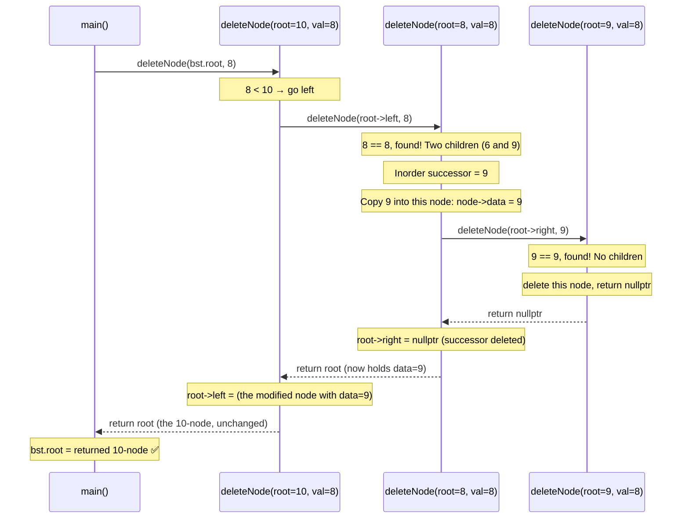

**The tree before and after, pointer by pointer:**

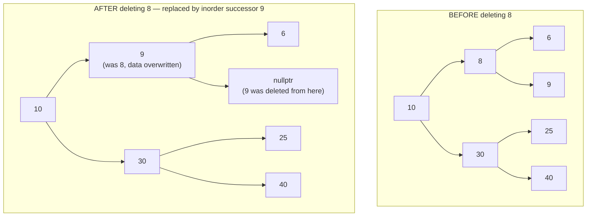

Without the return-and-rewire pattern, you'd need to pass a pointer's parent and manually update its child — much messier. The recursive return makes the code elegant.

---

## 6. NULL vs nullptr — and What a Crash Looks Like

Your old code uses `NULL`. Modern C++ uses `nullptr`. Know both.

| | `NULL` | `nullptr` |
|---|---|---|
| Type | `int` (literally 0 or `(void*)0`) | `std::nullptr_t` — its own type |
| Type safety | Can be implicitly cast to int — causes ambiguous overloads | Won't convert to int — safer |
| Which to use | Legacy code / C | Any C++11 or newer code ✅ |

They behave identically for pointer comparisons — `if (node == NULL)` and `if (node == nullptr)` do the same thing.

### What happens when you dereference NULL

```cpp
Node* p = nullptr;
cout << p->data;    // ← SEGMENTATION FAULT — program crashes
```

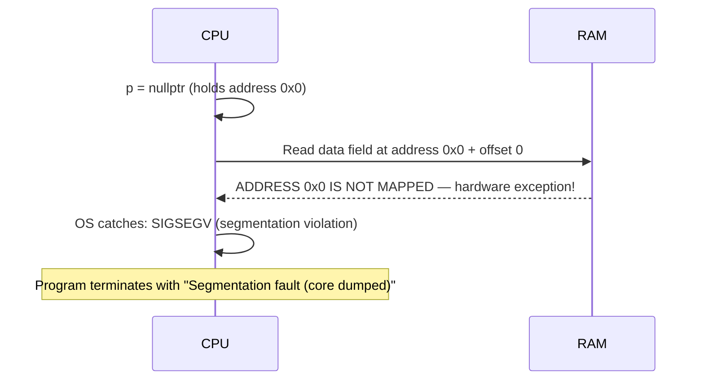

The OS deliberately does not map address 0 to any physical RAM for exactly this reason — accessing it always crashes, making NULL dereferences immediately detectable rather than silently reading garbage.

### The Safe Pattern — Always Check Before Dereferencing

```cpp
// In every recursive tree function, the first line is your guard:
void inorderTraversal(Node* root) {
    if (root == NULL) return;    // ← guard: if we got a null pointer, stop recursing
    // safe beyond this point
    inorderTraversal(root->left);
    cout << root->data;
    inorderTraversal(root->right);
}
```

Without this guard, calling `inorderTraversal` on an empty tree (`root == NULL`) would crash on `root->data`.

---

## 7. Tree Properties and Math Theorems

These are the formulas exams love and that you need to reason about complexity.

### Binary Tree Math

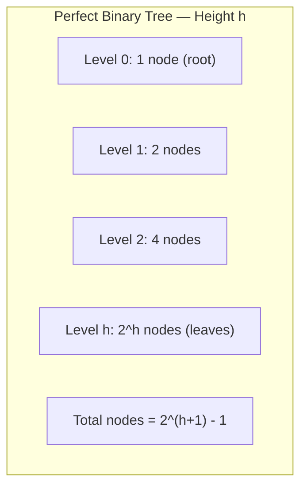

| Property | Formula | Example (h=3) |
|---|---|---|
| Nodes at level `h` | `2^h` | Level 3 → 8 nodes |
| Total nodes (perfect tree, height h) | `2^(h+1) - 1` | `2^4 - 1 = 15` |
| Height given n nodes (perfect) | `⌊log₂(n)⌋` | 15 nodes → height 3 |
| Min height for n nodes | `⌊log₂(n)⌋` | (balanced case) |
| Max height for n nodes | `n - 1` | (degenerate/skewed case) |
| Max nodes at height h | `2^h` | |
| Min nodes for height h | `h + 1` | (one node per level — stick) |

### Why This Matters for Complexity

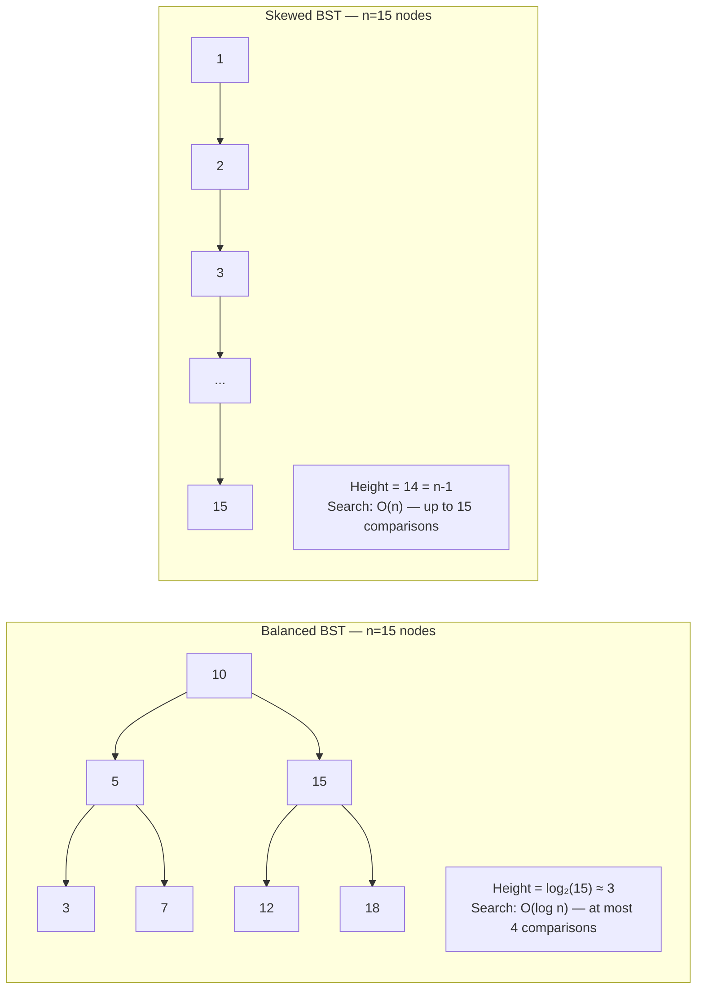

**The devastating implication:** If you insert sorted data into a BST (1, 2, 3, 4, 5...), it degenerates into a linked list. BST guarantees O(log n) only when balanced.

### Leaf and Internal Node Counts

For any binary tree:
- If a tree has `L` leaf nodes, it has **at least** `L-1` internal nodes.
- A **full** binary tree (every node has 0 or 2 children) with `L` leaves has exactly `L-1` internal nodes.

---

## 8. Your Code Through the Memory Lens

### Why `createNode` takes `Node*&` but traversals take `Node*`

```cpp
// createNode — needs to change what the pointer points to
void createNode(Node*& node, int value) {
    node = new Node;    // ← modifying the pointer itself → needs reference
    node->data = value;
    node->left = NULL;
    node->right = NULL;
}

// inorderTraversal — only reads, never changes what root points to
void inorderTraversal(Node* root) {
    if (root == NULL) return;
    inorderTraversal(root->left);    // passing address of left child by value — fine
    cout << root->data << " ";
    inorderTraversal(root->right);   // passing address of right child by value — fine
}
```

### Why `findInorderSuccessor` (your `findMinimum`) starts at `root->right`

```cpp
Node* findMinimum(Node* root) {          // called as: findMinimum(root) where root is the deletion target
    Node* currentNode = root->right;     // immediately jumps to right subtree
    while(currentNode != NULL && currentNode->left != NULL) {
        currentNode = currentNode->left;
    }
    return currentNode;
}
```

This function is misnamed. It does **not** find the minimum of the tree rooted at `root`. It finds the **inorder successor** of `root` — the smallest node in `root`'s right subtree. If you called it on a node with no right child, it would return NULL or crash.

The correct name is `findInorderSuccessor`. A true `findMinimum(Node* root)` would be:

```cpp
Node* findMinimum(Node* root) {
    while (root->left != NULL) root = root->left;  // go left until you can't
    return root;
}
```

### The Missing Return Warning in deleteNode

```cpp
Node* deleteNode(Node*& root, int value) {
    if (root == NULL) { return root; }        // path 1: returns ✅
    if (value < root->data) {
        root->left = deleteNode(root->left, value);
        return root;                           // path 2: returns ✅
    }
    if (value > root->data) {
        root->right = deleteNode(root->right, value);
        return root;                           // path 3: returns ✅
    }
    if (value == root->data) {                 // ← compiler sees: what if NONE of these ifs fire?
        // case 1: no children
        if (root->left == NULL && root->right == NULL) {
            delete root; return NULL;          // path 4: returns ✅
        }
        // case 2: one child
        if (root->left == NULL) { ... return temp; }   // path 5: returns ✅
        if (root->right == NULL) { ... return temp; }  // path 6: returns ✅
        // case 3: two children — but where is the return?
        Node* temp = findMinimum(root);
        root->data = temp->data;
        root->right = deleteNode(root->right, temp->data);
        return root;                           // path 7: returns ✅ — but compiler misses this!
    }
    // ← compiler thinks: if none of the ifs above fired, we fall here with no return
}
```

Every logical path returns. But the compiler is not smart enough to prove that `<`, `>`, and `==` are exhaustive. The fix:

```cpp
// Change:
if (value == root->data) { ... }
// To:
else { ... }   // or just remove the if entirely since it's the only remaining case
```

---

## Summary

```
KEY MENTAL MODELS:
  Node* = a number (a memory address), not the node itself
  Tree = chain of heap blocks linked by addresses stored in each block
  Stack memory = auto, fast, small, function-scoped
  Heap memory = manual, larger, lives until you delete it

POINTER SIGNATURES:
  Node* p     → copy of address, can read/modify Node fields, cannot change what p points to
  Node*& p    → alias for the caller's pointer, CAN change what it points to (insert, delete)

RETURN-AND-REWIRE:
  Every recursive function that may change the tree structure returns Node*
  The caller wires the return value back into the tree
  This is how insertNode and deleteNode work without needing parent pointers

TREE MATH:
  Balanced: height = O(log n) → O(log n) operations
  Skewed:   height = O(n)     → O(n) operations (as bad as linear search)
  Perfect tree with n nodes: height = log₂(n+1) - 1

YOUR CODE BUGS TO REMEMBER:
  findMinimum() is actually findInorderSuccessor() — misnamed but correct for its usage
  deleteNode() has a missing final return — fix by changing last if(==) to else
  No destructor means memory leaks — acceptable for exam code
```
