# All Tree Traversals — The Complete Deep Dive
## Why They Work, How They Work, When to Use Each

---

## Table of Contents
1. [The Four Traversals — The Big Picture](#1-the-four-traversals--the-big-picture)
2. [The Reference Tree We'll Use](#2-the-reference-tree-well-use)
3. [Inorder — Left, Root, Right](#3-inorder--left-root-right)
4. [Preorder — Root, Left, Right](#4-preorder--root-left-right)
5. [Postorder — Left, Right, Root](#5-postorder--left-right-root)
6. [Level Order — BFS](#6-level-order--bfs)
7. [The Mirror Insight — Recursion IS a Stack](#7-the-mirror-insight--recursion-is-a-stack)
8. [Iterative Traversals — Your DFS Code Explained](#8-iterative-traversals--your-dfs-code-explained)
9. [Traversal Cheat Sheet and Use Cases](#9-traversal-cheat-sheet-and-use-cases)

---

## 1. The Four Traversals — The Big Picture

All four traversals visit **every node exactly once**. What differs is the **order** in which nodes are visited. That order is determined by one question: **when do you process the root relative to its subtrees?**

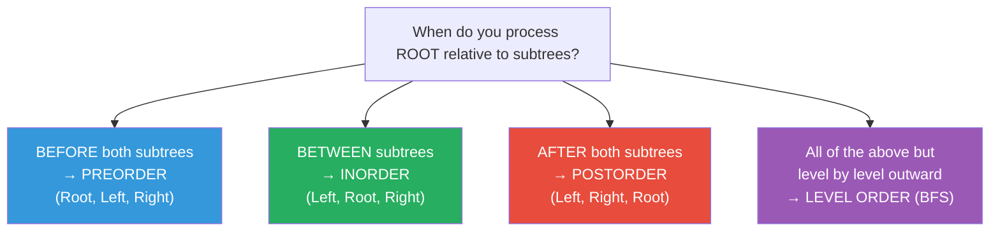

The word "root" in the traversal name refers to the **root of any subtree**, not just the global root. The rule applies recursively at every node.

---

## 2. The Reference Tree We'll Use

We'll use this tree for every traversal throughout this document:

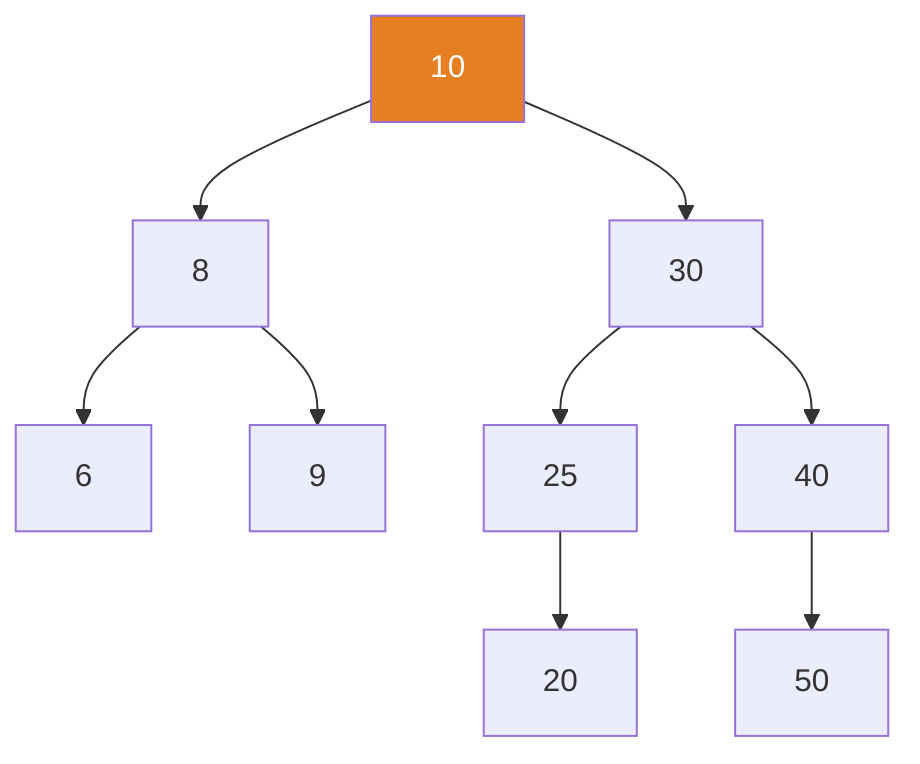

This is the exact tree built by your `Binary_Search_Tree_RECURSIVE.cpp` file.

**Expected outputs:**
- Inorder:   `6 8 9 10 20 25 30 40 50`
- Preorder:  `10 8 6 9 30 25 20 40 50`
- Postorder: `6 9 8 20 25 50 40 30 10`

---

## 3. Inorder — Left, Root, Right

### Why This Order?

Inorder exists because of the **BST property**. For any BST node N:
- Everything in the left subtree is smaller than N
- Everything in the right subtree is larger than N

If you visit **Left first, then Root, then Right**, you naturally visit nodes in ascending order. Inorder traversal of ANY BST always produces sorted output. This is its primary use case.

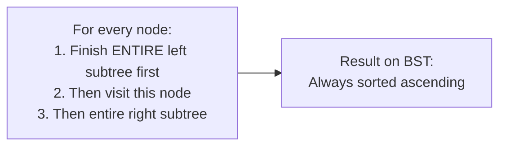

### Recursive Code — Your File

```cpp
void inorderTraversal(Node* root) {
    if (root == NULL) return;           // Line A: base case — null node, stop
    inorderTraversal(root->left);       // Line B: recurse ALL the way left first
    cout << root->data << " ";          // Line C: THEN print this node
    inorderTraversal(root->right);      // Line D: THEN recurse right
}
```

### Full Call Stack Simulation

Each row shows one function call. Indentation = depth on the call stack.

```
inorder(10)                    → Line B fires → call inorder(8)
  inorder(8)                   → Line B fires → call inorder(6)
    inorder(6)                 → Line B fires → call inorder(NULL)
      inorder(NULL)            → Line A fires → return immediately
    ← back in inorder(6)       → Line C fires → PRINT 6
                               → Line D fires → call inorder(NULL)
      inorder(NULL)            → return
    ← back in inorder(6)       → function ends, return to inorder(8)
  ← back in inorder(8)         → Line C fires → PRINT 8
                               → Line D fires → call inorder(9)
    inorder(9)                 → Line B → inorder(NULL) → return
    ← back in inorder(9)       → PRINT 9
                               → Line D → inorder(NULL) → return
    ← inorder(9) ends
  ← back in inorder(8) ends
← back in inorder(10)          → Line C fires → PRINT 10
                               → Line D fires → call inorder(30)
  inorder(30)                  → call inorder(25)
    inorder(25)                → call inorder(20)
      inorder(20)              → inorder(NULL) → return, PRINT 20, inorder(NULL) → return
    ← inorder(25)              → PRINT 25, call inorder(NULL) → return
  ← inorder(30)                → PRINT 30, call inorder(40)
    inorder(40)                → inorder(NULL) → return, PRINT 40, call inorder(50)
      inorder(50)              → PRINT 50
    ← inorder(40) ends
  ← inorder(30) ends
← inorder(10) ends

OUTPUT: 6  8  9  10  20  25  30  40  50
```

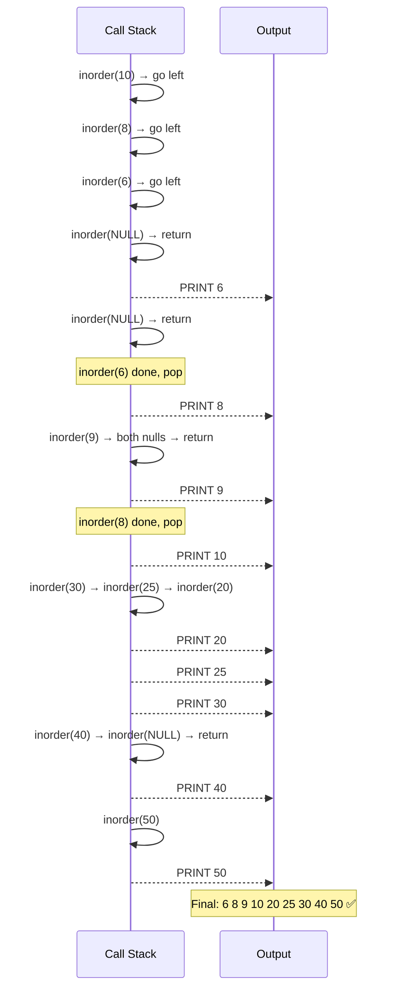

---

## 4. Preorder — Root, Left, Right

### Why This Order?

Preorder visits the **root before any of its children**. This means the first value you ever see in a preorder sequence is always the root of that subtree. This makes preorder the right choice for:

- **Copying a tree** — if you feed a preorder sequence into `insertNode`, you reconstruct an identical tree
- **Serialization** — save a tree to a file and restore it
- **Printing directory structures** — the folder name before its contents

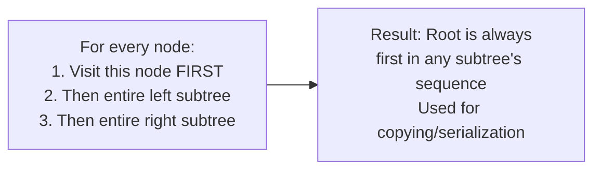

### Recursive Code

```cpp
void preorderTraversal(Node* root) {
    if (root == NULL) return;
    cout << root->data << " ";         // Line A: print FIRST — before any recursion
    preorderTraversal(root->left);     // Line B: then left subtree
    preorderTraversal(root->right);    // Line C: then right subtree
}
```

### Call Stack Simulation

```
preorder(10) → PRINT 10 → call preorder(8)
  preorder(8) → PRINT 8 → call preorder(6)
    preorder(6) → PRINT 6 → call preorder(NULL) → return
               → call preorder(NULL) → return
    preorder(6) ends
  preorder(8) after left → call preorder(9)
    preorder(9) → PRINT 9 → both nulls → return
  preorder(8) ends
preorder(10) after left → call preorder(30)
  preorder(30) → PRINT 30 → call preorder(25)
    preorder(25) → PRINT 25 → call preorder(20)
      preorder(20) → PRINT 20 → both nulls → return
    preorder(25) after left → NULL → return
    preorder(25) ends
  preorder(30) after left → call preorder(40)
    preorder(40) → PRINT 40 → NULL → return → call preorder(50)
      preorder(50) → PRINT 50 → both nulls → return
    preorder(40) ends
  preorder(30) ends
preorder(10) ends

OUTPUT: 10  8  6  9  30  25  20  40  50
```

**Notice:** The root (10) appears first. Then the entire left subtree of 10 (8, 6, 9) is printed completely before 30's subtree starts. The pattern repeats at every level.

---

## 5. Postorder — Left, Right, Root

### Why This Order?

Postorder processes **children before parents**. This is crucial when an operation on a node depends on its children being completed first:

- **Deleting a tree** — you must delete children before their parent, or you lose the pointers
- **Evaluating expression trees** — evaluate both operands before applying the operator
- **Computing subtree properties** — height, size, sum — each node's answer depends on its children

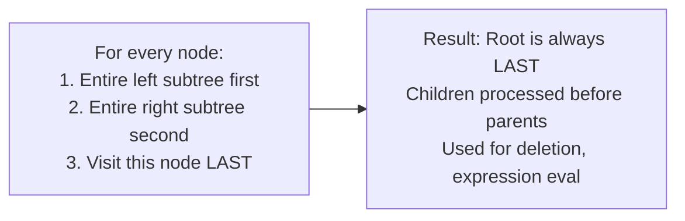

### Recursive Code

```cpp
void postorderTraversal(Node* root) {
    if (root == NULL) return;
    postorderTraversal(root->left);    // Line A: left subtree completely done first
    postorderTraversal(root->right);   // Line B: right subtree completely done second
    cout << root->data << " ";         // Line C: THEN print — after ALL descendants
}
```

### Call Stack Simulation

```
postorder(10) → call postorder(8)
  postorder(8) → call postorder(6)
    postorder(6) → NULL → NULL → PRINT 6
  postorder(8) → call postorder(9)
    postorder(9) → NULL → NULL → PRINT 9
  postorder(8) → PRINT 8   ← both children done, now print 8
postorder(10) → call postorder(30)
  postorder(30) → call postorder(25)
    postorder(25) → call postorder(20)
      postorder(20) → NULL → NULL → PRINT 20
    postorder(25) → NULL right → PRINT 25
  postorder(30) → call postorder(40)
    postorder(40) → NULL → call postorder(50)
      postorder(50) → NULL → NULL → PRINT 50
    postorder(40) → PRINT 40   ← both children done
  postorder(30) → PRINT 30
postorder(10) → PRINT 10   ← very last: the global root

OUTPUT: 6  9  8  20  25  50  40  30  10
```

**Notice:** 10 is printed dead last. The whole left subtree (6, 9, 8) finishes before the right subtree starts. Within the right subtree, 30 prints last because 25 and 40 must finish first.

---

## 6. Level Order — BFS

### Why This Order?

Level order is conceptually different from the others. It doesn't use recursion (the call stack) — it uses an **explicit queue**. Instead of going deep into one branch, it visits every node at the current depth before going deeper.

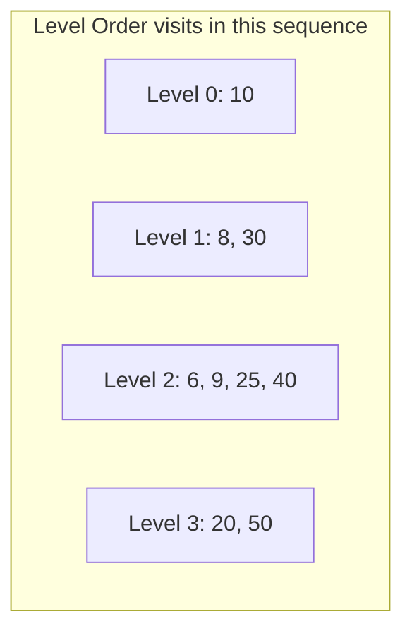

### The Queue Mechanism — Why It Produces Level Order

The queue's **FIFO** property is the key. When you process node X and enqueue its children, those children sit **behind all the other nodes at X's level** that haven't been processed yet. By the time you reach them, the entire current level has been printed.

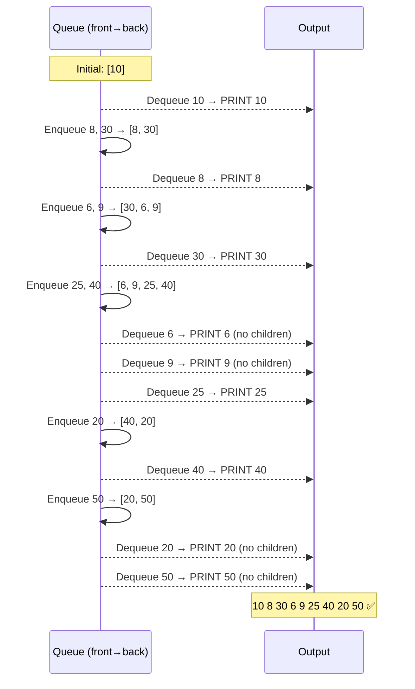

### Code — Your BFS File

```cpp
void BST_BreadthFirstSearch(Node* root) {
    queue<Node*> q;

    if (root == NULL) return;   // guard for empty tree

    q.push(root);               // seed: start with just the root
    while (!q.empty()) {        // keep going until queue is empty
        Node* currentNode = q.front();
        q.pop();                // remove from front

        cout << currentNode->data << " ";   // process this node

        if (currentNode->left != NULL)  q.push(currentNode->left);   // enqueue children
        if (currentNode->right != NULL) q.push(currentNode->right);  // right goes after left
    }
}
```

**Critical detail:** You enqueue children (addresses) not values. The queue holds pointers to Node objects, which you later dereference with `->` when you process them.

---

## 7. The Mirror Insight — Recursion IS a Stack

The most important conceptual connection to understand before tackling iterative traversals:

> **Every recursive traversal is secretly using a stack — the call stack. The iterative version just makes that stack explicit.**

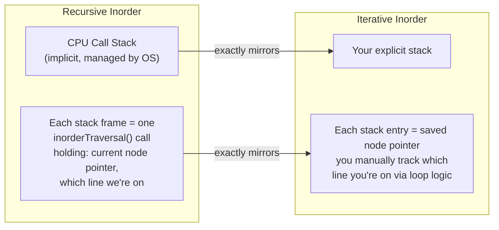

The recursive call `inorderTraversal(root->left)` pushes a new stack frame. When that call returns, we're back in the caller exactly where we left off. The iterative version does this manually: push the node, later pop it and continue with the right subtree.

---

## 8. Iterative Traversals — Your DFS Code Explained

### Preorder Iterative — Your Code

```cpp
void BST_DepthFirstSearch_PREORDER_Traversal(Node* root) {
    stack<Node*> DFSStack;
    if (root == NULL) return;

    DFSStack.push(root);
    while (!DFSStack.empty()) {
        Node* currentNode = DFSStack.top();
        DFSStack.pop();

        cout << currentNode->data << " ";   // print IMMEDIATELY — preorder is root first

        if (currentNode->right != NULL) DFSStack.push(currentNode->right);  // right BEFORE left
        if (currentNode->left  != NULL) DFSStack.push(currentNode->left);   // left ON TOP
    }
}
```

**The trick:** Push **right before left**. Since a stack is LIFO, the left child ends up on top and is processed next — giving you Left before Right, matching preorder's root→left→right pattern.

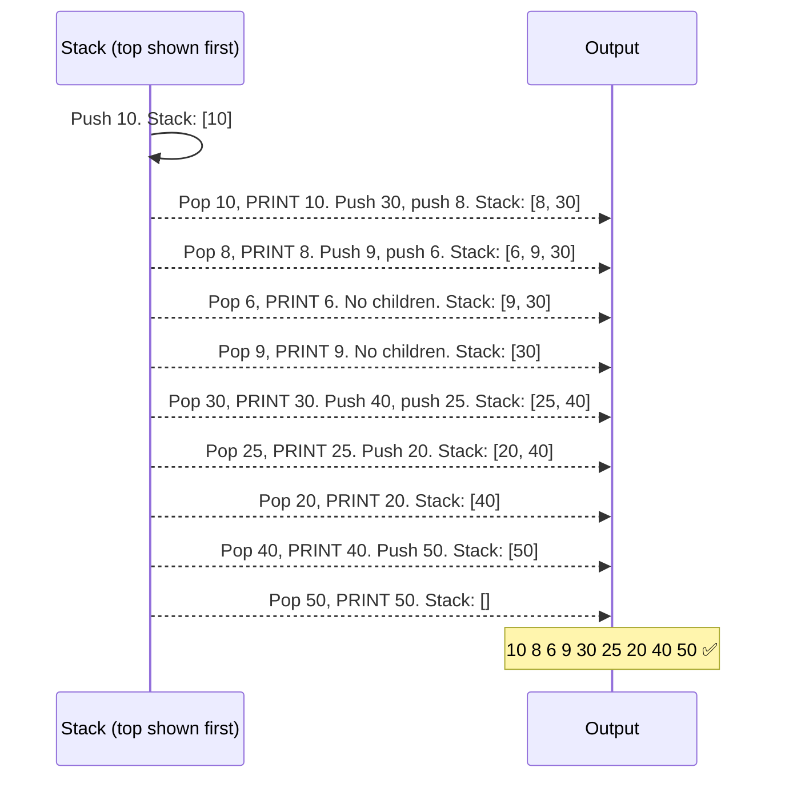

---

### Inorder Iterative — The Hardest One

```cpp
void BST_DepthFirstSearch_INORDER_Traversal(Node* root) {
    stack<Node*> DFSStack;
    Node* currentNode = root;       // ← second pointer! this is the "where are we going" pointer

    while (currentNode != NULL || !DFSStack.empty()) {
        while (currentNode != NULL) {      // Phase 1: go as far LEFT as possible
            DFSStack.push(currentNode);    // save this node — we'll come back to print it
            currentNode = currentNode->left;
        }
        // currentNode is now NULL — we hit a dead end going left

        currentNode = DFSStack.top();   // Phase 2: backtrack — get saved node
        DFSStack.pop();

        cout << currentNode->data << " ";  // Phase 3: print it — all left subtree is done

        currentNode = currentNode->right;  // Phase 4: now explore right subtree
    }
}
```

**The two-pointer pattern is the key:**
- `currentNode` = "where am I going next / what am I currently exploring"
- `DFSStack` = "what nodes have I visited on the way down that I still need to process"

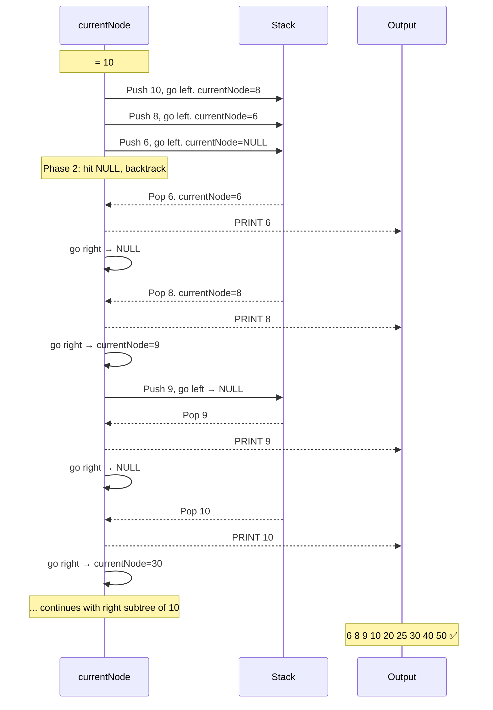

---

### Postorder Iterative — The Two-Stack Trick

```cpp
void BST_DepthFirstSearch_POSTORDER_Traversal(Node* root) {
    if (root == NULL) return;
    stack<Node*> s1, s2;
    s1.push(root);

    while (!s1.empty()) {
        Node* node = s1.top(); s1.pop();
        s2.push(node);              // ← collect in s2 instead of printing

        if (node->left)  s1.push(node->left);   // push LEFT then right
        if (node->right) s1.push(node->right);  // RIGHT goes on top of s1
    }

    while (!s2.empty()) {           // now print s2 in reverse order
        cout << s2.top()->data << " ";
        s2.pop();
    }
}
```

**The insight — why two stacks work:**

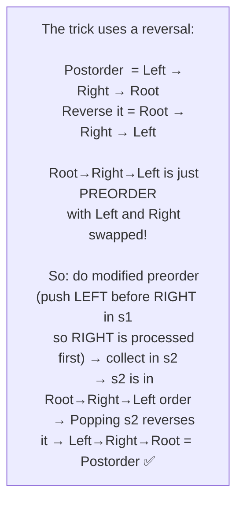

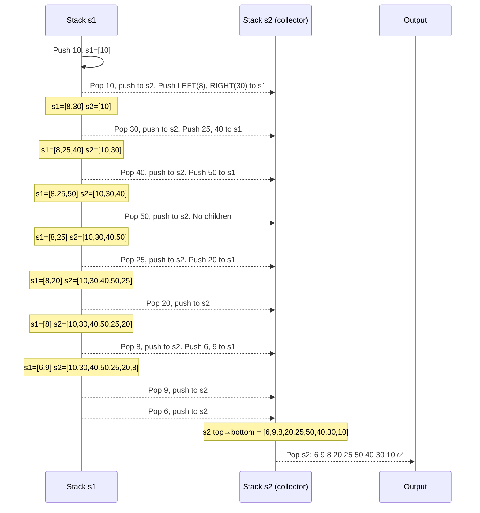

---

## 9. Traversal Cheat Sheet and Use Cases

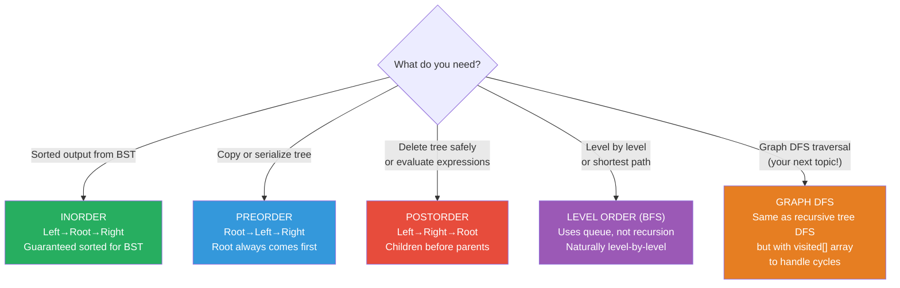

### Full Comparison Table

| Traversal | Order | Uses | Data Structure | Recursive? |
|---|---|---|---|---|
| **Inorder** | L → Root → R | Sorted output, BST validation | Call stack | Yes (iterative: 1 stack + current pointer) |
| **Preorder** | Root → L → R | Clone tree, serialize, directory print | Call stack | Yes (iterative: 1 stack, push right before left) |
| **Postorder** | L → R → Root | Delete tree, expression eval, bottom-up DP | Call stack | Yes (iterative: 2 stacks) |
| **Level Order** | Level by level | Shortest path (unweighted), print by depth | Queue | No — uses queue from the start |

### Use Case Examples — Real Problems

```cpp
// INORDER — Find kth smallest element in BST
int count = 0, result = -1;
void kthSmallest(Node* root, int k) {
    if (!root) return;
    kthSmallest(root->left, k);   // go smallest first
    if (++count == k) { result = root->data; return; }
    kthSmallest(root->right, k);
}

// PREORDER — Serialize tree to string
string serialize(Node* root) {
    if (!root) return "# ";       // # represents null
    return to_string(root->data) + " "
         + serialize(root->left)
         + serialize(root->right);
}
// Output for our tree: "10 8 6 # # 9 # # 30 25 20 # # # 40 # 50 # # "

// POSTORDER — Compute height (each node needs children's heights first)
int height(Node* root) {
    if (!root) return -1;
    int leftH  = height(root->left);    // compute left subtree height first
    int rightH = height(root->right);   // compute right subtree height first
    return 1 + max(leftH, rightH);      // then compute THIS node's height
}

// LEVEL ORDER — Print tree level by level (with grouping)
vector<vector<int>> levelOrderGrouped(Node* root) {
    vector<vector<int>> result;
    if (!root) return result;
    queue<Node*> q;
    q.push(root);
    while (!q.empty()) {
        int levelSize = q.size();       // snapshot: how many nodes are on this level?
        vector<int> level;
        for (int i = 0; i < levelSize; i++) {
            Node* node = q.front(); q.pop();
            level.push_back(node->data);
            if (node->left)  q.push(node->left);
            if (node->right) q.push(node->right);
        }
        result.push_back(level);
    }
    return result;
    // Returns: [[10], [8,30], [6,9,25,40], [20,50]]
}
```

### The Graph Bridge — Why This All Matters

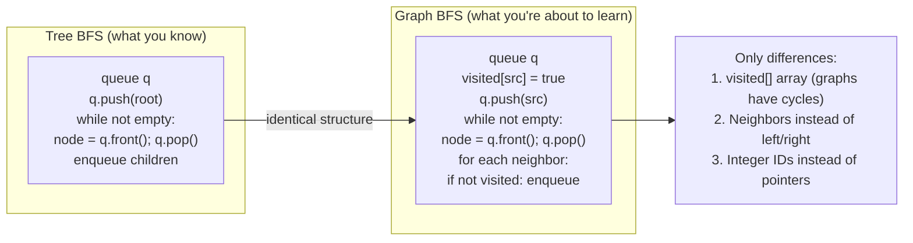

The BFS you wrote for your BST is **functionally identical** to graph BFS. The only addition is `visited[]` to prevent infinite loops (since graphs can have cycles — trees cannot). Once you internalize tree BFS, graph BFS is trivially easy.
