# BST Operations — The Complete Deep Dive
## Insert, Search, Delete, Expression Trees — Every Case Explained

---

## Table of Contents
1. [The BST Invariant — The Contract That Makes Everything Work](#1-the-bst-invariant--the-contract-that-makes-everything-work)
2. [Search — Why It's O(log n) and When It Isn't](#2-search--why-its-olog-n-and-when-it-isnt)
3. [Insert — How Recursion Finds the Right Slot](#3-insert--how-recursion-finds-the-right-slot)
4. [Delete — All Three Cases With Full Intuition](#4-delete--all-three-cases-with-full-intuition)
5. [The Inorder Successor — Why It's Chosen](#5-the-inorder-successor--why-its-chosen)
6. [Your findMinimum Bug — Fully Dissected](#6-your-findminimum-bug--fully-dissected)
7. [The Missing Return Warning — How to Fix It](#7-the-missing-return-warning--how-to-fix-it)
8. [Complexity Analysis — Balanced vs Skewed](#8-complexity-analysis--balanced-vs-skewed)
9. [Expression Tree — How Your ShuntingYard Works](#9-expression-tree--how-your-shuntingyard-works)

---

## 1. The BST Invariant — The Contract That Makes Everything Work

The BST property is a **contract** that every node promises to uphold:

> For any node N:
> - **Every** node in N's left subtree has a value **strictly less than** N's value
> - **Every** node in N's right subtree has a value **strictly greater than** N's value
> - This holds for **every node** in the tree, not just the root

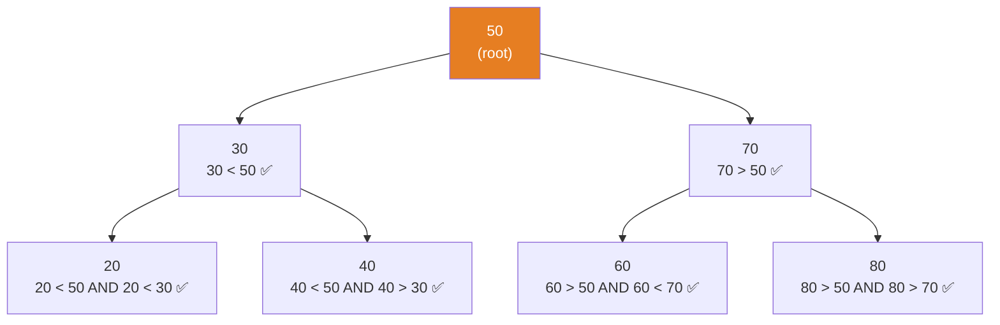

### Why Subtree, Not Just Children?

This is the mistake many students make. The property is about the **entire subtree**, not just direct children.

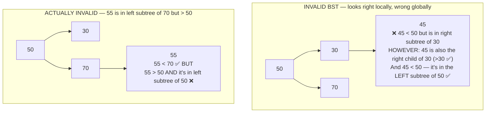

The only correct way to validate a BST is to pass **bounds** down the recursion:

```cpp
bool isValidBST(Node* root, long long lo = LLONG_MIN, long long hi = LLONG_MAX) {
    if (!root) return true;
    if (root->data <= lo || root->data >= hi) return false;
    return isValidBST(root->left,  lo, root->data) &&   // left: tighten upper bound
           isValidBST(root->right, root->data, hi);     // right: tighten lower bound
}
```

---

## 2. Search — Why It's O(log n) and When It Isn't

### The Binary Search Property

At every node, the BST invariant tells you exactly which half of the remaining tree to search. You eliminate half the possibilities with each comparison — identical to binary search on a sorted array.

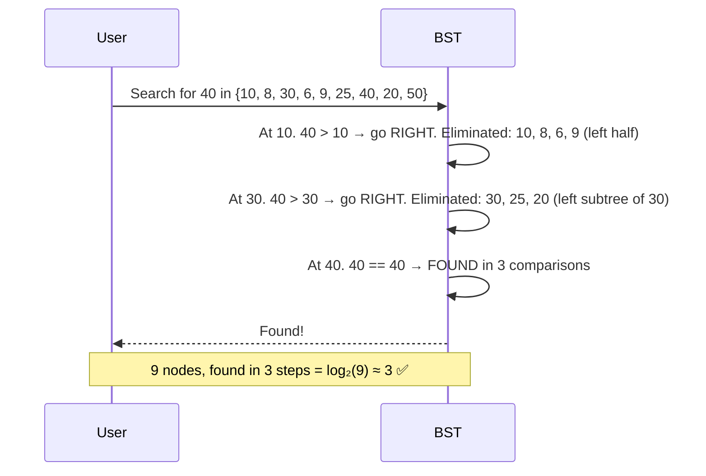

```cpp
// Iterative search — clear and efficient
Node* search(Node* root, int value) {
    while (root != NULL) {
        if (value == root->data) return root;       // found
        else if (value < root->data) root = root->left;   // go left
        else root = root->right;                    // go right
    }
    return NULL;   // not found
}
```

### The Worst Case — When BST Becomes a Linked List

If you insert data in sorted order (1, 2, 3, 4, 5...), every insertion goes to the right child. The BST degenerates:

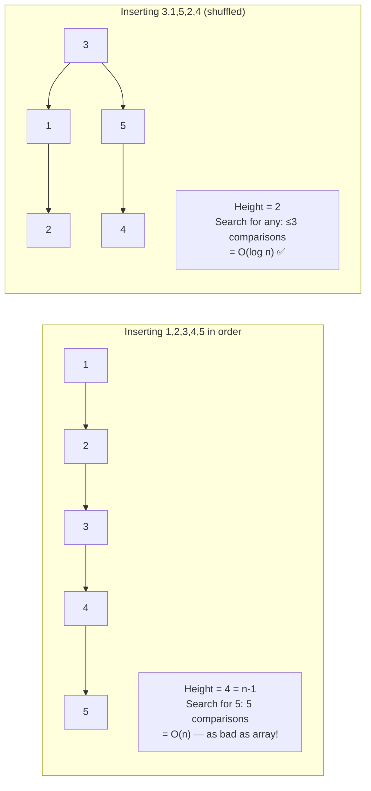

**Takeaway:** BST is O(log n) on **average** for random data. Without balancing (AVL, Red-Black), worst case is O(n). This is why balanced BSTs exist — they guarantee O(log n) always.

---

## 3. Insert — How Recursion Finds the Right Slot

### The Core Idea

Insertion uses the same BST property as search to navigate to the **correct empty slot**, then creates the node there.

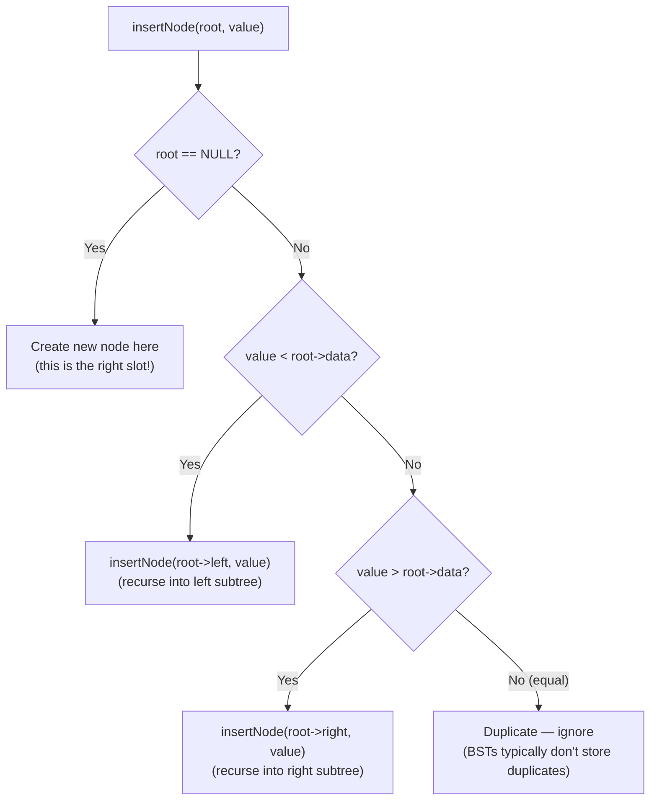

### Your Code — Why `Node*&` is Critical

```cpp
void insertNode(Node*& node, int value) {   // ← Node*& is the key
    if (node == NULL) {
        createNode(node, value);   // node = new Node; modifies CALLER's pointer
        return;
    } else if (value < node->data) {
        insertNode(node->left, value);    // passes root->left BY REFERENCE
    } else if (value > node->data) {
        insertNode(node->right, value);   // passes root->right BY REFERENCE
    }
}
```

The reference chain: When you call `insertNode(node->left, value)`, you're passing `node->left` by reference. Inside the next call, `node` is an alias for the caller's `node->left`. When the base case fires and does `node = new Node`, it's actually writing into `root->left` (or `root->right`) of the parent — directly wiring the new node into the tree.

### Full Insertion Trace — Adding 7 to Our Tree

Starting tree: 10, 8, 30, 6, 9, 25, 40, 20, 50

```
insertNode(root=10, 7):   7 < 10 → insertNode(root->left, 7)
insertNode(root=8, 7):    7 < 8  → insertNode(root->left, 7)
insertNode(root=6, 7):    7 > 6  → insertNode(root->right, 7)
insertNode(root=NULL, 7): root == NULL → createNode(root, 7)
                          → root = new Node(7)
                          → This sets 6's right child to new Node(7) ✅
```

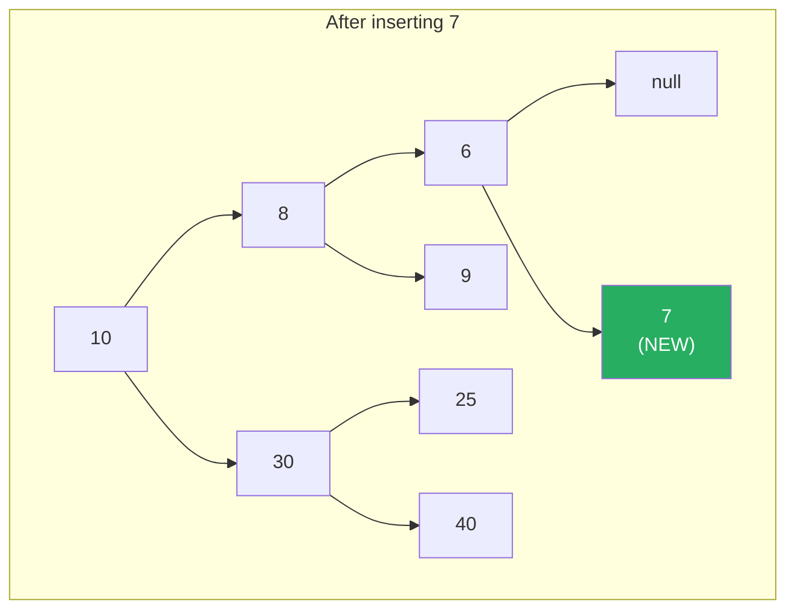

---

## 4. Delete — All Three Cases With Full Intuition

Deletion is the hardest BST operation. There are three cases, and each exists for a structural reason.

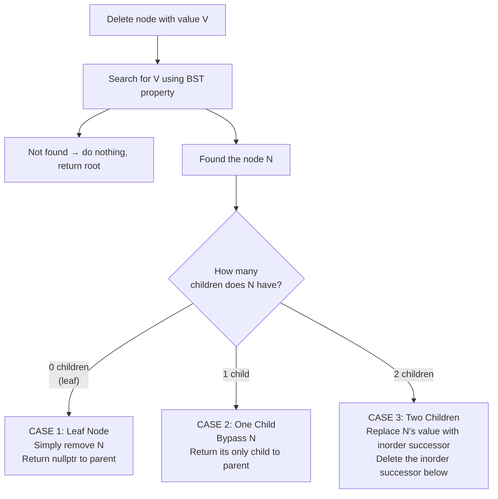

### Case 1: Delete a Leaf (No Children)

The simplest case. The node has no children, so removing it doesn't disconnect anything.

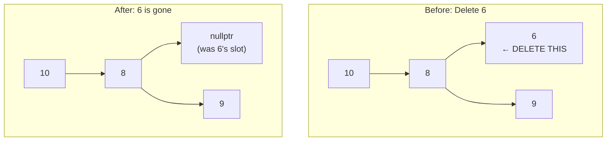

```cpp
// In deleteNode, when we've found node with value == root->data:
if (root->left == NULL && root->right == NULL) {
    delete root;    // free the memory
    return NULL;    // tell parent: your child pointer should now be nullptr
}
// Parent does: root->left = deleteNode(root->left, value)
//              root->left = NULL  ← the NULL return wires this in
```

### Case 2: Delete a Node with One Child

Bypass the node — make its parent adopt its only child.

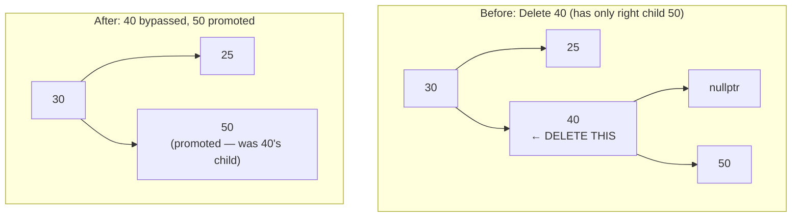

```cpp
// Case 2a: no left child — return right child
if (root->left == NULL) {
    Node* temp = root->right;   // save the only child
    delete root;                // free this node
    return temp;                // parent adopts the saved child
}

// Case 2b: no right child — return left child
if (root->right == NULL) {
    Node* temp = root->left;
    delete root;
    return temp;
}
// Parent does: root->right = deleteNode(root->right, value)
//              root->right = temp (= 50)  ← adoption wired in
```

### Case 3: Delete a Node with Two Children — The Complex Case

You can't just remove a node with two children — you'd have two orphaned subtrees with no parent. You need to **replace** the node with a value that can legally sit in its position.

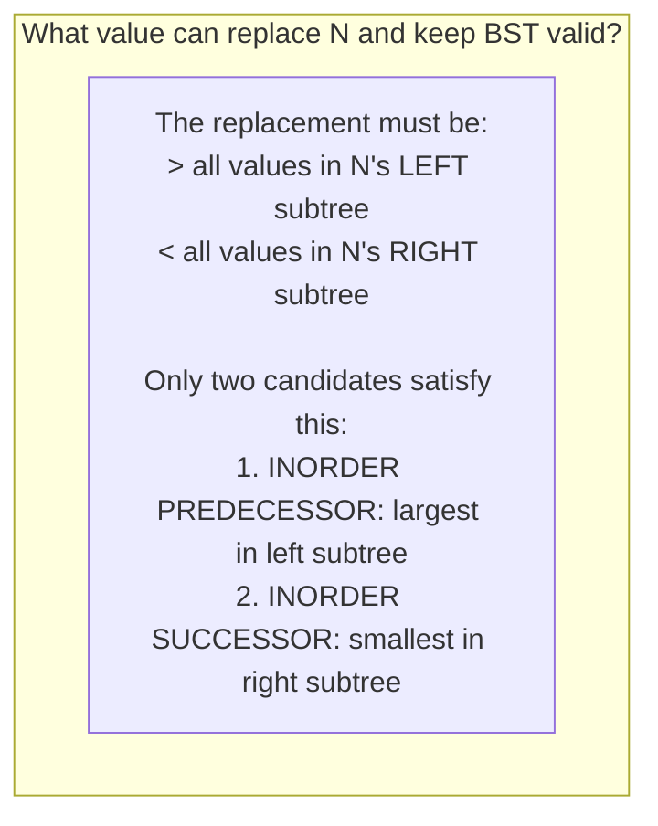

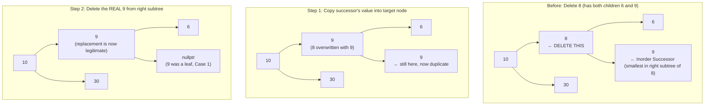

**Why the inorder successor specifically?** It's the smallest value in the right subtree, so:
- It's larger than everything in the left subtree (we can slot it where 8 was and the left invariant holds)
- It's the smallest in the right subtree, so deleting it from there leaves the right subtree valid
- It has **at most one child** (a right child only — if it had a left child, that left child would be smaller and would be the actual minimum, contradicting our assumption it's the minimum)

```cpp
// Case 3 in your code:
Node* temp = findMinimum(root);       // find inorder successor (misnamed, but correct logic)
root->data = temp->data;              // overwrite current node's value
root->right = deleteNode(root->right, temp->data);  // delete successor from right subtree
return root;                          // return this node (still in the same position)
```

### Full Delete Trace — Deleting 30 (Two Children: 25 and 40)

```
deleteNode(root=10, 30): 30 > 10 → go right
deleteNode(root=30, 30): 30 == 30, two children (25 and 40)
  findInorderSuccessor(30): go to 30->right = 40, then leftmost of 40 = 40 (no left child)
  → successor = 40
  root->data = 40  (overwrite 30 with 40)
  root->right = deleteNode(root->right=40, 40)
    deleteNode(root=40, 40): 40 == 40
      40 has no left child, has right child 50
      Case 2: return temp = 50
    → root->right = 50  (50 takes 40's old position)
  return root  (now holds data=40, left=25, right=50)
```

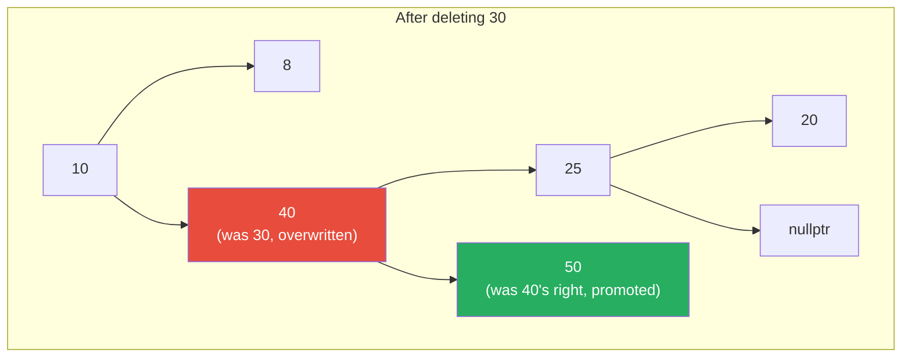

---

## 5. The Inorder Successor — Why It's Chosen

The inorder successor of node N is the **next node in inorder traversal** after N — i.e., the smallest value greater than N.

**Algorithm to find it:** Go one step to N's right, then go as far LEFT as possible.

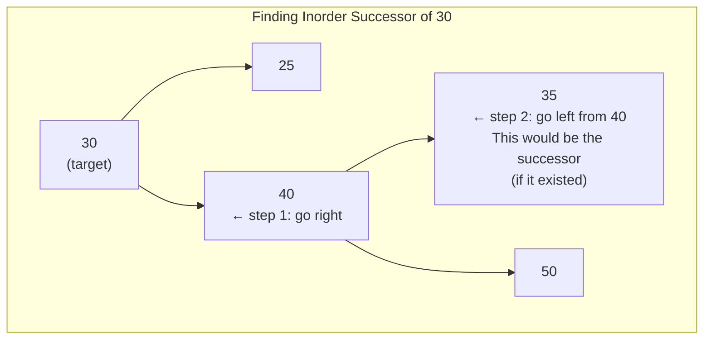

```cpp
// Correct implementation:
Node* findInorderSuccessor(Node* node) {
    Node* current = node->right;      // step 1: go right once
    while (current->left != NULL) {   // step 2: go left as far as possible
        current = current->left;
    }
    return current;
}
```

**Why not the inorder predecessor (largest in left subtree)?** You could use either — both maintain BST validity. Conventionally, most textbooks and implementations use the successor. Your code uses the successor.

---

## 6. Your `findMinimum` Bug — Fully Dissected

```cpp
// YOUR CODE:
Node* findMinimum(Node* root) {
    Node* currentNode = root->right;   // ← starts at RIGHT child immediately!
    while (currentNode != NULL && currentNode->left != NULL) {
        currentNode = currentNode->left;
    }
    return currentNode;
}
```

**What it actually does:** Finds the inorder successor of `root` — the minimum of `root`'s right subtree.

**What the name implies:** Finding the minimum of the subtree rooted at `root`, which would be the leftmost descendant.

| Call | Expected (true minimum) | Actual (inorder successor) |
|---|---|---|
| `findMinimum(root=10)` | 6 (leftmost of whole tree) | 20 (leftmost of 10's right subtree) |
| `findMinimum(node=8)` | 6 (leftmost of 8's subtree) | 9 (8's right child, no left) |
| `findMinimum(node=30)` | 20 (leftmost of 30's subtree) | 40 (30's right child, no left) |

**Why it still works for deletion:** Because `findMinimum` is only ever called inside `deleteNode` as `findMinimum(root)` where `root` is the node being deleted. In that context, you want the inorder successor, and the function correctly computes that. The naming is wrong, the behavior is right for the specific usage. But if you ever called `findMinimum(bst.root)` expecting the minimum of the whole tree, you'd get the wrong answer.

**The corrected version that does what the name says:**

```cpp
// TRUE minimum of subtree rooted at 'node':
Node* findMinimum(Node* node) {
    while (node->left != NULL) {   // go left until you can't
        node = node->left;
    }
    return node;
    // For our tree called on root(10): returns 6 ✅
}

// SEPARATE function for deletion:
Node* findInorderSuccessor(Node* node) {
    return findMinimum(node->right);  // minimum of right subtree
    // For node(8): minimum of {9} = 9 ✅
    // For node(30): minimum of {25,40,20,50} starting at 40... wait
    // Actually: node->right = 40, then findMinimum(40) goes left: 40 has no left → returns 40 ✅
}
```

---

## 7. The Missing Return Warning — How to Fix It

**The warning:** `control reaches end of non-void function`

**Where it appears:** At the closing `}` of `deleteNode`.

**Why:** The compiler reads your function as: "what if none of the `if` chains fire?" Logically impossible (value must be <, >, or == to data), but the compiler doesn't prove this.

```cpp
// CURRENT (triggers warning):
Node* deleteNode(Node*& root, int value) {
    if (root == NULL)      { return root; }
    if (value < root->data) { ... return root; }
    if (value > root->data) { ... return root; }
    if (value == root->data) {
        // cases 1, 2, 3...
        // all paths return inside here
    }
    // ← compiler says: what if none of the 4 ifs matched? No return here!
}

// FIXED — one character change:
Node* deleteNode(Node*& root, int value) {
    if (root == NULL)       { return root; }
    if (value < root->data) { ... return root; }
    if (value > root->data) { ... return root; }
    else {                                        // ← 'else' instead of 'if (value == root->data)'
        // now compiler sees: if not <, not >, then definitely this else runs
        // cases 1, 2, 3...
    }
    // no fall-through possible → warning gone
}
```

---

## 8. Complexity Analysis — Balanced vs Skewed

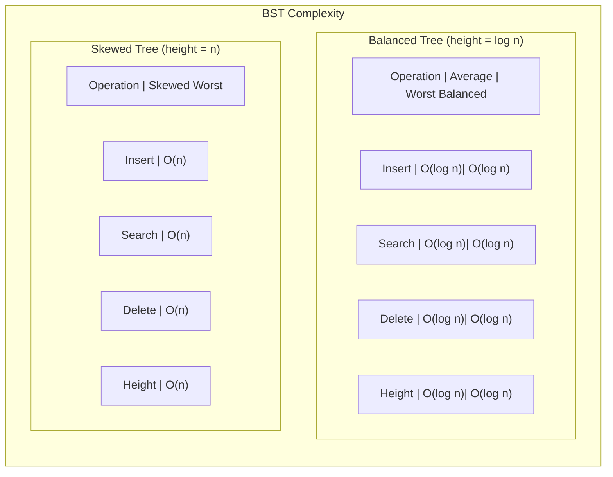

| Operation | Average (random input) | Best (balanced) | Worst (sorted input) |
|---|---|---|---|
| Search | O(log n) | O(log n) | O(n) |
| Insert | O(log n) | O(log n) | O(n) |
| Delete | O(log n) | O(log n) | O(n) |
| Inorder traversal | O(n) | O(n) | O(n) |
| Space (tree) | O(n) | O(n) | O(n) |
| Space (recursion stack) | O(log n) | O(log n) | O(n) |

**Why O(log n) for balanced:** At each step you eliminate half the remaining nodes. After k steps, you've eliminated at most `1 + 2 + 4 + ... + 2^(k-1) = 2^k - 1` nodes. You stop when k = log₂(n).

**Why O(n) for skewed:** The tree is a linked list. You might traverse every node before finding your target.

---

## 9. Expression Tree — How Your ShuntingYard Works

Your `ExpressionBST_ShuntingYard.cpp` is the most advanced file you wrote. Let me walk through exactly how it works, because it elegantly combines everything about trees.

### What Is an Expression Tree?

An expression tree stores a mathematical expression so that:
- **Leaf nodes** are operands (numbers, variables)
- **Internal nodes** are operators (+, -, *, /)
- **Inorder traversal** gives the original infix expression
- **Postorder traversal** gives the postfix (RPN) expression
- **Evaluation** is done by postorder traversal (evaluate children, then apply operator)

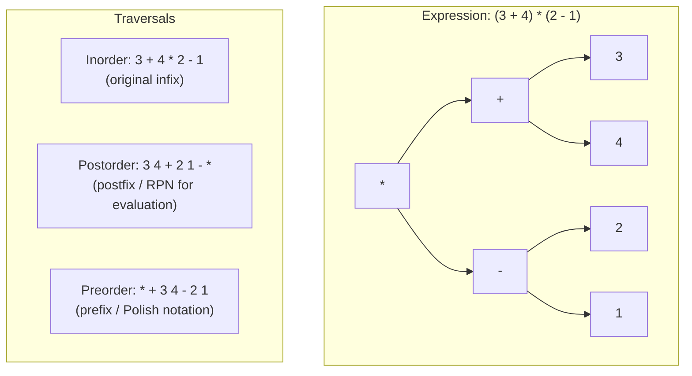

### The Shunting Yard Algorithm — Converting Infix to Postfix

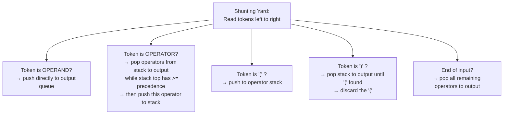

### Walkthrough: `3 + 4 * 2`

```
Tokens: [3, +, 4, *, 2]
Stack: []  Output: []

Token = 3  → operand → Output: [3]
Token = +  → operator, stack empty → push. Stack: [+]
Token = 4  → operand → Output: [3, 4]
Token = *  → operator, * has higher precedence than + → push. Stack: [+, *]
Token = 2  → operand → Output: [3, 4, 2]
End         → pop stack: pop *, pop +. Output: [3, 4, 2, *, +]

Postfix: 3 4 2 * +   (correct: 4*2 first, then +3)
```

### Building the Expression Tree from Postfix

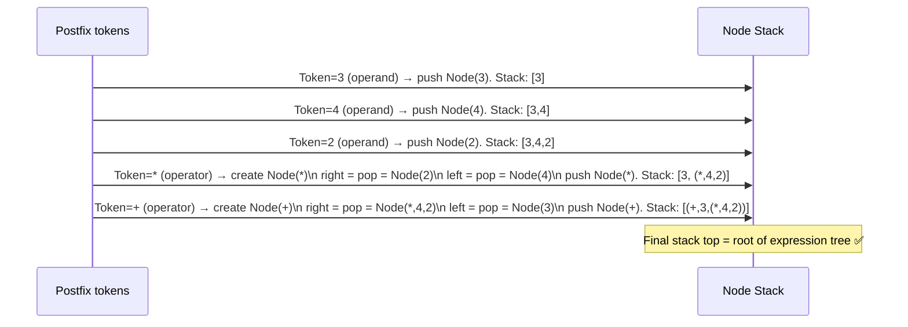

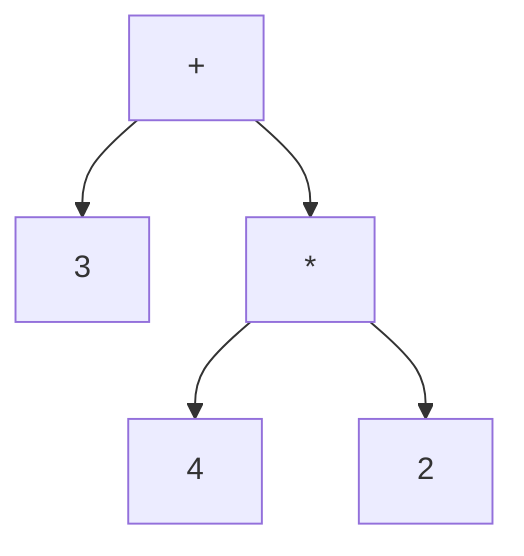

**Why postorder evaluates the expression correctly:**

```
postorder(+):
  postorder(3): return 3
  postorder(*):
    postorder(4): return 4
    postorder(2): return 2
    apply *: return 4*2 = 8
  apply +: return 3+8 = 11   ✅
```

### Your Code — Key Sections

```cpp
// BUILDING TREE FROM POSTFIX:
for(int i = 0; i < postfix.size(); i++){
    string token = postfix[i];

    if(isOperand(token)){
        nodeStack.push(createNode(token));  // operands become leaves
    }
    else if(isOperator(token)){
        Node<string>* newNode = createNode(token);  // operator becomes parent
        newNode->right = nodeStack.top(); nodeStack.pop();  // right child = most recent operand
        newNode->left  = nodeStack.top(); nodeStack.pop();  // left  child = second most recent
        nodeStack.push(newNode);    // push the subtree back — it may become a child later
    }
}
bst.root = nodeStack.top();   // last remaining node = root of whole tree
```

**Why right is popped before left:** A postfix expression processes right operand last (it's on top of the stack), but in an expression tree the right child corresponds to the right operand. Pop order matches.

**The template `<typename T>`:** Your code uses C++ templates so the tree can hold any type — in this case `string` tokens. The BST property doesn't apply to expression trees (they're not ordered by value, they're ordered by expression structure). The struct is reusing the Node type but operating more like a general binary tree.

### Minor Issues in Your Expression File

```cpp
// Issue 1: Unused variable warning
int exprLength = expression.length();   // ← declared but never used
// Fix: just delete this line

// Issue 2: Signed/unsigned comparison warning
for(int i = 0; i < postfix.size(); i++){  // ← int vs size_t
// Fix: use size_t or cast:
for(int i = 0; i < (int)postfix.size(); i++){
// Or use range-based for:
for(auto& token : postfix){ ... }
```

---

## Summary

```
BST INVARIANT:
  For every node N: ALL left descendants < N < ALL right descendants
  Validate with bounds passed down recursion, not just checking children

INSERT (Node*&):
  Navigate like search, create at the NULL slot
  Node*& required so base case can wire new node into parent's pointer

DELETE CASES:
  Case 1 (leaf):        delete, return nullptr
  Case 2 (one child):   save child, delete node, return child
  Case 3 (two children): find inorder successor (min of right subtree)
                         overwrite node's value, delete successor below

INORDER SUCCESSOR:
  go right once, then as far left as possible
  has at most one child (right), so deleting it is Case 1 or 2

COMPLEXITY:
  Balanced: O(log n) for search/insert/delete
  Skewed:   O(n)     — BST degrades to linked list with sorted input

EXPRESSION TREE:
  Leaves = operands, internal nodes = operators
  Postfix → tree: operands push as leaves, operators pop two children
  Postorder traversal = evaluation order
```
